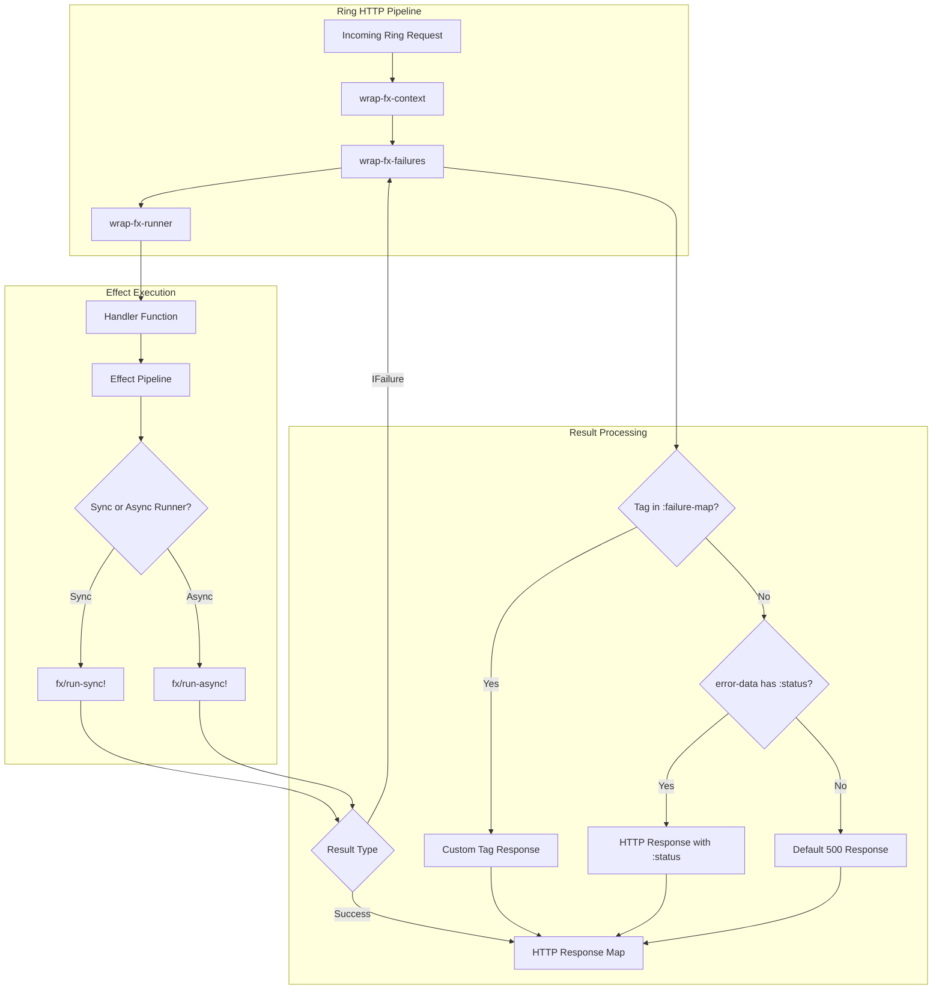

# Requirements

### Overview & Goals
The `fx.ring` module introduces first-class integration between the `fx` purely functional effect system and Ring HTTP web applications in Clojure. It enables web services to define HTTP handlers as pure, composable `Effect` pipelines rather than side-effecting functions returning raw response maps.

Key capabilities provided by `fx.ring`:
- **Effect-Driven Handlers**: Handlers return `IEffect` descriptions evaluated at the HTTP boundary via Ring middlewares.
- **Unified Failure Mapping**: Domain failures (`IFailure`) short-circuit cleanly and are converted into appropriate HTTP status codes and payloads via configurable middlewares.
- **Context & Dependency Injection**: Ring request maps and application dependencies (e.g., database connection pools from `fx-jdbc`) are injected directly into the `fx` context.
- **Ring Sync & Async Support**: Full compatibility with 1-arity synchronous `(fn [request])` and 3-arity asynchronous `(fn [request respond raise])` Ring handlers.

---

### Scope

#### In Scope
- New module `modules/fx-ring` with `deps.edn` and build integration.
- Context injection middleware (`wrap-fx-context`) providing `::fx-ring/request` and custom service dependencies.
- Effect execution middleware (`wrap-fx-runner`) executing effect handlers with `fx/run-sync!` and `fx/run-async!`.
- Failure translation middleware (`wrap-fx-failures`) mapping typed `IFailure` instances to Ring HTTP responses using a hybrid strategy (explicit tag map + `:status` extraction + default fallback).
- Convenience composite middleware (`wrap-fx`) that layers context, failure handling, and execution runner into a single wrapper.
- Effect constructors and combinators for HTTP responses (`response>`, `ok>`, `created>`, `bad-request>`, `not-found>`, `status>`, `header>`, `content-type>`) and request context extraction (`request>`).
- Comprehensive unit and integration test suite.

#### Out of Scope
- HTTP routing engines (reitit, compojure, bidi) — `fx.ring` remains standard Ring compliant and works with any router.
- JSON/transit serialization middleware (delegated to standard Ring middleware like `ring-json` or `muuntaja`).

---

### User Stories
- **As a backend developer**, I want to write HTTP handlers that return `Effect` pipelines so that my business logic, database transactions, and error handling remain pure and composable.
- **As an API developer**, I want domain failures (`fx/fail> :user/not-found {...}`) to automatically map to 404 responses at the HTTP boundary without sprinkling HTTP status codes throughout my core business logic.
- **As a system architect**, I want asynchronous Ring 3-arity endpoints to execute seamlessly via `fx/run-async!` to non-blockingly handle high-throughput requests.

---

### Functional Requirements
- `wrap-fx-runner` must accept handlers returning `IEffect` and evaluate them to produce Ring response maps.
- Handlers returning non-effect values (e.g. standard response maps) must pass through safely.
- `wrap-fx-failures` must intercept `IFailure` results and convert them to HTTP responses:
  - If a handler in `:failure-map` matches the failure `:tag`, invoke it with `(failure-handler error-data request)`.
  - Otherwise, if `error-data` contains `:status`, construct a response with that status code and remaining error data as body.
  - Otherwise, delegate to `:default-handler` (defaults to HTTP 500 Internal Server Error).
- `wrap-fx-context` must inject the request map into the effect context under `::fx-ring/request` and merge any extra services configured via `:services` or `(fn [request] ...)`.
- `request>` combinator must extract the active request map from the execution context.
- Response combinators (`ok>`, `created>`, `bad-request>`, `not-found>`, `status>`, `header>`) must produce valid `IEffect` descriptions resolving to Ring response maps.

---

### Non-Functional Requirements
- **Canonical Naming**: Strict adherence to repository guidelines (`>` for effect constructors/combinators, `!` for runners, `?` for predicates, no aliases).
- **Stack & Thread Safety**: Asynchronous pipelines evaluate via `CompletableFuture` non-blockingly; synchronous pipelines evaluate in constant stack space.
- **Zero Reflection**: Clean Clojure code with type hints where needed for optimal runtime performance.

# Technical Design

### Current Implementation
The repository contains:
- `modules/fx-core`: Pure effect system primitives (`succeed>`, `fail>`, `map>`, `mapcat>`, `provide-service>`, `run-sync!`, `run-async!`, `IFailure`, `IEffect`).
- `modules/fx-jdbc`: Database combinators and connection management via `next.jdbc`.
- `modules/fx-typed`: Typed Clojure annotations for effect system primitives.

Currently, there is no HTTP or Ring integration module in the repository.

---

### Key Decisions

#### Decision 1: Layered Middleware Architecture with Composite `wrap-fx`
- **Approach**: Implement granular middlewares (`wrap-fx-context`, `wrap-fx-failures`, `wrap-fx-runner`) and a high-level composite wrapper `wrap-fx`.
- **Rationale**: Allows developers to plug into existing Ring stacks flexibly or adopt the complete `fx` pipeline with a single line of code.

#### Decision 2: Hybrid Failure-to-Response Resolution Strategy
- **Approach**: Match failure tags against explicit `:failure-map` first; if not present, check for `:status` in `error-data`; fallback to `:default-handler` (HTTP 500).
- **Rationale**: Keeps domain logic completely decoupled from HTTP status codes while allowing endpoints that emit HTTP-specific failures to work without boilerplate.

#### Decision 3: Deterministic Argument & Return Types
- **Approach**: All combinators use monomorphic parameter contracts. Handlers wrapped by `wrap-fx-runner` return `IEffect` instances.
- **Rationale**: Follows the strict repository architecture directive prohibiting dual-mode callback vs effect arguments.

---

### Proposed Changes & Module Architecture

```
modules/fx-ring/
├── deps.edn
└── src/
    └── com/lambdaseq/fx/
        └── ring.clj             # Core middlewares (wrap-fx, wrap-fx-runner, wrap-fx-failures, wrap-fx-context)
        └── ring/
            └── response.clj    # HTTP effect constructors (response>, ok>, status>, header>, etc.)
```

#### Middleware Signatures & Contracts

```clojure
(ns com.lambdaseq.fx.ring
  (:require [com.lambdaseq.fx.core :as fx]))

;; Context Keys
(def request-key ::request)

;; Context Middleware
(defn wrap-fx-context
  "Injects the Ring request map into effect context under ::request.
   Accepts optional :services map or (fn [req] services-map)."
  ([handler] (wrap-fx-context handler nil))
  ([handler {:keys [services]}]))

;; Execution Runner Middleware
(defn wrap-fx-runner
  "Evaluates handler effects. Supports 1-arity (sync) and 3-arity (async) Ring handlers."
  [handler])

;; Failure Translation Middleware
(defn wrap-fx-failures
  "Converts IFailure instances to Ring response maps.
   Options:
     :failure-map      - Map of tag -> (fn [error-data request])
     :default-handler  - Fallback (fn [failure request]) returning 500 response"
  ([handler] (wrap-fx-failures handler nil))
  ([handler {:keys [failure-map default-handler]}]))

;; Composite Middleware
(defn wrap-fx
  "Convenience wrapper combining wrap-fx-context, wrap-fx-failures, and wrap-fx-runner."
  ([handler] (wrap-fx handler nil))
  ([handler opts]))
```

#### Response Combinators (`com.lambdaseq.fx.ring.response`)

```clojure
(defn request>
  "Creates an effect yielding the active Ring request map from context."
  []
  (fx/context> ::request))

(defn response> [body] ...)
(defn ok> [body] ...)
(defn created> [location body] ...)
(defn bad-request> [body] ...)
(defn not-found> [body] ...)
(defn status> [eff status-code] ...)
(defn header> [eff header-name header-value] ...)
(defn content-type> [eff content-type-str] ...)
```

---

### Architecture Diagram



---

### Risks & Mitigations
- **Async Thread Pools**: `fx/run-async!` uses `CompletableFuture`. Mitigated by properly attaching exception handlers to pass errors to Ring's 3-arity `raise` callback if unhandled.
- **Context Pollution**: Context injection could conflict with other middlewares. Mitigated by using namespaced keyword `::fx-ring/request`.

# Testing

### Validation Approach
Verification of `fx.ring` will be executed through automated unit tests and end-to-end integration tests using `clojure.test` and Cognitect test-runner.

---

### Key Scenarios

#### 1. Synchronous Handler Execution (`wrap-fx-runner`)
- Handler returns `(fx/succeed> {:status 200 :body "OK"})`.
- Verify middleware returns identical HTTP response map.
- Handler returns a chained effect `(-> (fx/succeed> "data") (fx/map> (fn [d] {:status 200 :body d})))`.
- Verify pipeline evaluates and returns 200 response with body `"data"`.

#### 2. Asynchronous Handler Execution (3-arity Ring)
- Asynchronous 3-arity handler returns an async effect chain.
- Verify `respond` callback is called with the resolved response map upon success.
- Verify `raise` callback is called if an uncaught exception escapes.

#### 3. Failure-to-Response Translation (`wrap-fx-failures`)
- **Explicit Tag Match**:
  - Handler returns `(fx/fail> :not-found {:id 42})`.
  - Configured `:failure-map {:not-found (fn [err req] {:status 404 :body (str "Missing " (:id err))})}`.
  - Verify returned response is `{:status 404, :body "Missing 42"}`.
- **Status Key in Error Data**:
  - Handler returns `(fx/fail> :auth/invalid-token {:status 401 :message "Expired"})`.
  - Without explicit tag mapping, verify response has `:status 401`.
- **Default Fallback**:
  - Handler returns `(fx/fail> :db/connection-timeout {:timeout 5000})`.
  - Verify default fallback responds with `:status 500` and sanitized body.

#### 4. Context & Service Injection (`wrap-fx-context` & `request>`)
- Handler queries `(fx-ring/request>)` in its effect pipeline.
- Verify handler receives the URI, headers, and params from the incoming Ring request map.
- Configure `:services {:db-pool pool}` in `wrap-fx-context`.
- Verify handler accesses the database pool via `(fx/service> :db-pool)`.

#### 5. HTTP Response Combinators
- Test `ok>`, `created>`, `not-found>`, `bad-request>`, `status>`, `header>`, and `content-type>`.
- Verify correct status codes, headers, and body composition.

---

### Edge Cases
- Non-effect return values: Handlers returning plain Clojure maps pass through unchanged without throwing.
- Handlers throwing raw JVM `Exception`: Intercepted gracefully and converted to failure or delegated to Ring `raise`.
- Nested context overrides: Inner `fx/provide-service>` calls do not overwrite request context unexpectedly.

# Delivery Steps

### ✓ Step 1: Setup fx-ring module structure and project configuration
The `fx-ring` module is registered in project dependencies and ready for implementation.

- Create `modules/fx-ring/deps.edn` referencing `com.lambdaseq/fx-core` and `ring/ring-core`.
- Update root `deps.edn` to register `fx/ring` under `:dev` aliases and add its test directory to `:test`.
- Update root `build.clj` test runner arguments to include `"-d" "modules/fx-ring/test"`.
- Establish module directory structure for `src/com/lambdaseq/fx/ring/` and `test/com/lambdaseq/fx/ring/`.

### ✓ Step 2: Implement HTTP response and request effect combinators
Pure effect constructors and combinators for constructing Ring HTTP responses and reading request context are available.

- Implement `request>` effect constructor to retrieve the active Ring request map from context (`::fx-ring/request`).
- Implement `response>` effect constructor to wrap an arbitrary body into a standard 200 Ring response map `{:status 200, :headers {}, :body body}`.
- Implement HTTP status effect constructors: `ok>`, `created>`, `bad-request>`, `not-found>`, `internal-server-error>`, and generic `status>` / `header>` / `content-type>` combinators.
- Ensure all effect constructors strictly adhere to canonical `>` suffixing and monomorphic parameter contracts.

### ✓ Step 3: Implement execution runner and context injection middleware
Ring middleware wraps effect handlers and executes them using synchronous or asynchronous fx runners.

- Implement `wrap-fx-context` middleware to inject the incoming Ring request and custom user services into the execution context map under `::fx-ring/request`.
- Implement `wrap-fx-runner` middleware to evaluate handlers that return `IEffect` instances using `fx/run-sync!` for 1-arity sync handlers.
- Add support for 3-arity asynchronous Ring handlers `(fn [req respond raise])` in `wrap-fx-runner` using `fx/run-async!`.
- Ensure thrown unhandled exceptions in the handler or runner are caught and safely propagated.

### ✓ Step 4: Implement failure-to-response mapping and composite middleware
Failures emitted by effect pipelines are automatically translated to well-formed HTTP error responses.

- Implement failure resolution logic supporting the hybrid strategy: check user-provided `:failure-map` first, check `:status` keyword or key in `error-data`, and fallback to default 500 handler.
- Implement `wrap-fx-failures` middleware to intercept `IFailure` records and convert them to Ring response maps.
- Implement `wrap-fx` convenience middleware composing `wrap-fx-context`, `wrap-fx-failures`, and `wrap-fx-runner` with unified options.
- Add support for both sync (1-arity) and async (3-arity) Ring failure handling.

### ✓ Step 5: Add comprehensive test suite and validation
The entire fx.ring module is validated with automated unit and integration tests.

- Implement unit tests for all response and request combinators (`response>`, `ok>`, `status>`, `header>`, `request>`).
- Implement tests for `wrap-fx-runner` covering synchronous 1-arity and asynchronous 3-arity effect handlers.
- Implement tests for `wrap-fx-failures` verifying tag map dispatch, `:status` key derivation, and fallback 500 responses.
- Implement end-to-end integration tests chaining `fx.ring` with `fx.jdbc` and `fx.core` workflows.