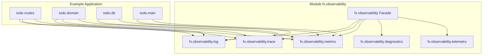

# Requirements

### Overview & Goals
Refactor the namespaces within the **`fx-observability`** module (`modules/fx-observability`) from the top-level prefix `fx.<concern>` (`fx.log`, `fx.trace`, `fx.metrics`, `fx.diagnostics`, `fx.telemetry`) to hierarchical sub-namespaces under **`fx.observability.<concern>`** (`fx.observability.log`, `fx.observability.trace`, `fx.observability.metrics`, `fx.observability.diagnostics`, `fx.observability.telemetry`), while keeping **`fx.observability`** as the unified root facade.

This ensures proper namespace grouping, prevents collision with any core namespaces, clarifies module boundaries, and maintains consistent conventions across all consumers (`example/`, documentation, and tests).

### Scope

#### In Scope
- **`modules/fx-observability` source structure**:
  - Move and rename `src/fx/log.cljc` -> `src/fx/observability/log.cljc` (`fx.observability.log`).
  - Move and rename `src/fx/trace.cljc` -> `src/fx/observability/trace.cljc` (`fx.observability.trace`).
  - Move and rename `src/fx/metrics.cljc` -> `src/fx/observability/metrics.cljc` (`fx.observability.metrics`).
  - Move and rename `src/fx/diagnostics.cljc` -> `src/fx/observability/diagnostics.cljc` (`fx.observability.diagnostics`).
  - Move and rename `src/fx/telemetry.cljc` -> `src/fx/observability/telemetry.cljc` (`fx.observability.telemetry`).
  - Update `src/fx/observability.cljc` facade to require and re-export from `fx.observability.*`.
- **`modules/fx-observability` test suite**:
  - Move and rename `test/fx/*_test.cljc` files to `test/fx/observability/*_test.cljc` with corresponding `fx.observability.*-test` namespaces.
  - Update all test namespace declarations and requires.
- **`example/` application**:
  - Update `example/src/todo/main.clj`, `routes.clj`, `domain.clj`, `db.clj` to require `fx.observability.log`, `fx.observability.trace`, and `fx.observability.metrics`.
  - Update `example/test/todo/routes_test.clj`, `api_test.clj`, etc.
  - Update `example/README.md`.
- **Documentation**:
  - Update `modules/fx-observability/README.md` and root `README.md` with new namespace paths.

#### Out of Scope
- Modifying `fx.core`, `fx.jdbc`, or `fx.ring` core functionality.
- Adding third-party external dependencies.

### User Stories
- **As a library consumer**, I want observability sub-namespaces grouped under `fx.observability.*` (e.g., `fx.observability.metrics`) so that the namespace hierarchy cleanly matches the artifact/module structure without cluttering the root `fx.*` namespace hierarchy.
- **As a maintainer**, I want the filesystem layout under `src/fx/observability/` to match Clojure classpath resolution standards for `fx.observability.*`.

### Functional Requirements
- **FR-1 (Namespace Renaming)**: All sub-namespaces within `modules/fx-observability` must be declared under `fx.observability.<concern>` (`log`, `trace`, `metrics`, `diagnostics`, `telemetry`).
- **FR-2 (File Relocation)**: Files must be located at `src/fx/observability/<concern>.cljc` and `test/fx/observability/<concern>_test.cljc` to strictly adhere to Clojure classpath requirements.
- **FR-3 (Facade Integrity)**: `fx.observability` must continue to expose all primary combinators (`log-info>`, `annotate-logs>`, `with-span>`, `track-duration>`, `sandbox>`, `render-cause`, etc.) by requiring the newly relocated sub-namespaces.
- **FR-4 (Consumer Migration)**: All usages in the `example/` project, test suites, and documentation must be updated to the new namespace paths.

### Non-Functional Requirements
- **Zero API Breakage in Behavior**: All combinator signatures, contracts, and execution behavior remain identical.
- **Clean Test Execution**: Full multi-module test runner (`clojure -T:build test`) and example test runner (`clojure -M:test`) must pass with 0 errors and 0 failures.

# Technical Design

### Current Implementation
Currently, `modules/fx-observability` defines:
- `src/fx/log.cljc` (`ns fx.log`)
- `src/fx/trace.cljc` (`ns fx.trace`)
- `src/fx/metrics.cljc` (`ns fx.metrics`)
- `src/fx/diagnostics.cljc` (`ns fx.diagnostics`)
- `src/fx/telemetry.cljc` (`ns fx.telemetry`)
- `src/fx/observability.cljc` (`ns fx.observability`)

And consumers require them as `[fx.log :as log]`, `[fx.metrics :as metrics]`, `[fx.trace :as trace]`.

### Key Decisions
1. **Hierarchical Sub-Namespaces (`fx.observability.*`)**:
   - *Decision*: Relocate all individual concern namespaces under `fx.observability.` (e.g. `fx.observability.metrics`).
   - *Rationale*: Clarifies that these namespaces belong to the `fx.observability` module and ensures zero namespace collisions if future modules are added.
2. **Preserve `fx.observability` Facade**:
   - *Decision*: Keep `src/fx/observability.cljc` at `fx.observability` and update its internal requires to `fx.observability.log`, `fx.observability.trace`, `fx.observability.metrics`, `fx.observability.diagnostics`, `fx.observability.telemetry`.
   - *Rationale*: Users who prefer requiring a single namespace `[fx.observability :as obs]` can continue to do so.

### Proposed Changes & File Mappings

#### 1. Module Source Files
| Old Path & Namespace | New Path & Namespace |
|---|---|
| `src/fx/log.cljc` (`fx.log`) | `src/fx/observability/log.cljc` (`fx.observability.log`) |
| `src/fx/trace.cljc` (`fx.trace`) | `src/fx/observability/trace.cljc` (`fx.observability.trace`) |
| `src/fx/metrics.cljc` (`fx.metrics`) | `src/fx/observability/metrics.cljc` (`fx.observability.metrics`) |
| `src/fx/diagnostics.cljc` (`fx.diagnostics`) | `src/fx/observability/diagnostics.cljc` (`fx.observability.diagnostics`) |
| `src/fx/telemetry.cljc` (`fx.telemetry`) | `src/fx/observability/telemetry.cljc` (`fx.observability.telemetry`) |
| `src/fx/observability.cljc` (`fx.observability`) | `src/fx/observability.cljc` (`fx.observability`) — updated requires |

#### 2. Module Test Files
| Old Path & Namespace | New Path & Namespace |
|---|---|
| `test/fx/log_test.cljc` (`fx.log-test`) | `test/fx/observability/log_test.cljc` (`fx.observability.log-test`) |
| `test/fx/trace_test.cljc` (`fx.trace-test`) | `test/fx/observability/trace_test.cljc` (`fx.observability.trace-test`) |
| `test/fx/metrics_test.cljc` (`fx.metrics-test`) | `test/fx/observability/metrics_test.cljc` (`fx.observability.metrics-test`) |
| `test/fx/diagnostics_test.cljc` (`fx.diagnostics-test`) | `test/fx/observability/diagnostics_test.cljc` (`fx.observability.diagnostics-test`) |
| `test/fx/telemetry_test.cljc` (`fx.telemetry-test`) | `test/fx/observability/telemetry_test.cljc` (`fx.observability.telemetry-test`) |
| `test/fx/observability_test.cljc` (`fx.observability-test`) | `test/fx/observability/observability_test.cljc` (`fx.observability.observability-test`) |

#### 3. Example Project & Documentation
- Update `example/src/todo/main.clj`: `[fx.observability.log :as log]`, `[fx.observability.metrics :as metrics]`
- Update `example/src/todo/routes.clj`: `[fx.observability.log :as log]`, `[fx.observability.metrics :as metrics]`, `[fx.observability.trace :as trace]`
- Update `example/src/todo/domain.clj`: `[fx.observability.log :as log]`, `[fx.observability.metrics :as metrics]`, `[fx.observability.trace :as trace]`
- Update `example/src/todo/db.clj`: `[fx.observability.metrics :as metrics]`, `[fx.observability.trace :as trace]`
- Update `example/test/todo/routes_test.clj`, `example/test/todo/api_test.clj`
- Update `modules/fx-observability/README.md`, `example/README.md`, and root `README.md`.

### Architecture Diagram

### Risks & Mitigations
- **Risk:** Stale files remaining at old paths leading to duplicate classpath conflicts.
  - *Mitigation:* Ensure old files under `src/fx/` and `test/fx/` in `fx-observability` are cleanly removed after moving to `src/fx/observability/` and `test/fx/observability/`.
- **Risk:** Unupdated test runner paths or requires.
  - *Mitigation:* Run `clojure -T:build test` across all submodules and `clojure -M:test` in `example/` to verify clean resolution and test execution.

# Testing

### Validation Approach
Automated tests will be run across both the submodules and the example application:
1. `modules/fx-observability` unit tests covering all renamed namespaces (`fx.observability.log-test`, `fx.observability.trace-test`, `fx.observability.metrics-test`, `fx.observability.diagnostics-test`, `fx.observability.telemetry-test`, `fx.observability.observability-test`).
2. Global multi-module test runner (`clojure -T:build test`).
3. Example project test runner (`clojure -M:dev:test:example -m cognitect.test-runner -d example/test`).

### Key Scenarios
- Verify `fx.observability.log` functions correctly with log level filtering, annotations, and sinks.
- Verify `fx.observability.trace` generates spans, attributes, and formats W3C traceparents.
- Verify `fx.observability.metrics` records counters, timers, gauges, and yields accurate snapshots.
- Verify `fx.observability.diagnostics` builds cause trees and renders formatted ASCII output.
- Verify `fx.observability` facade correctly delegates to all sub-namespaces.
- Verify `example` application starts, handles requests with traces and metrics, and passes all domain and route tests.

# Execution Plan

### ✓ Step 1: Relocate and update source files in fx-observability
- Create `src/fx/observability/` directory and move `log.cljc`, `trace.cljc`, `metrics.cljc`, `diagnostics.cljc`, `telemetry.cljc`.
- Update namespace declarations to `fx.observability.log`, `fx.observability.trace`, `fx.observability.metrics`, `fx.observability.diagnostics`, `fx.observability.telemetry`.
- Update internal requires across source files.
- Remove old source files from `src/fx/`.

### ✓ Step 2: Update facade fx.observability
- Update `src/fx/observability.cljc` requires to point to `fx.observability.*`.

### ✓ Step 3: Relocate and update test files in fx-observability
- Create `test/fx/observability/` directory and move all `*_test.cljc` files.
- Update test namespace declarations and requires to `fx.observability.*-test` and `fx.observability.*`.
- Remove old test files from `test/fx/`.

### ✓ Step 4: Update example project
- Update requires in `example/src/todo/main.clj`, `routes.clj`, `domain.clj`, `db.clj`.
- Update requires in `example/test/todo/routes_test.clj`, `api_test.clj`, `domain_test.clj`, `db_test.clj`.
- Update `example/README.md`.

### ✓ Step 5: Update documentation
- Update `modules/fx-observability/README.md` and root `README.md` to reflect `fx.observability.*` namespace paths.

### ✓ Step 6: Execute full verification and test suites
- Run `clojure -T:build test` across all submodules.
- Run `clojure -M:test` in `example/`.