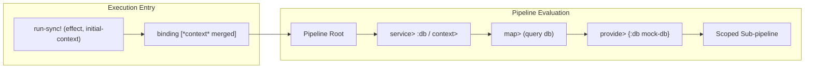

# Requirements

### Overview & Goals
The objective of this design is to equip `com.lambdaseq.fx.core` with first-class Dependency Injection (DI) and Context Provision capabilities. By enabling pure effects to declare and consume external dependencies (such as database connection pools, HTTP clients, configuration maps, and loggers) without hardcoding global state or polluting function signatures, we maximize software testability, modularity, and operational reliability while eliminating the defects associated with mutable global singletons.

### Scope
- **In Scope:**
  - Context access primitives: `context>`, `service>`.
  - Context-aware transformation combinators: `map-ctx>`, `do-ctx>`.
  - Context provision primitives: `provide>`, `provide-service>`.
  - Runner execution integration: `(run-sync! effect initial-context)`.
  - Typed Clojure annotations in `com.lambdaseq.fx.typed`.
  - Unit and type-level test suites.
  - End-to-end usage examples and documentation in `README.md`.
- **Out of Scope:**
  - Heavy reflection-based container frameworks or macroscopic lifecycle managers (e.g. Integrant, Component), though `fx` will seamlessly supply dependencies managed by them.
  - Asynchronous thread-pool executors (reserved for a dedicated async execution module).

### User Stories
- **Service Consumption:** As an effect author, I want to retrieve a service (e.g. `:db` or `:config`) directly from the effect execution context so that my domain logic remains pure and decoupled from infrastructure.
- **Environmental Injection:** As an application entry point, I want to supply a map of production dependencies when evaluating the root effect pipeline with `run-sync!`.
- **Test Mocking & Isolation:** As a test author, I want to inject mock services or in-memory stores into an existing effect pipeline using `provide>` so that tests execute deterministically in total isolation without hitting production resources.
- **Scoped Dependency Overrides:** As a developer, I want to override specific services for a localized sub-tree of effects without affecting the parent execution context.

### Functional Requirements
1. **Context Access (`context>`, `service>`, `map-ctx>`, `do-ctx>`):**
   - `(fx/context>)` returns an effect evaluating to the entire active context map.
   - `(fx/service> key)` returns an effect evaluating to the value associated with `key` in `*context*`.
   - `(fx/service> key default-val)` returns `default-val` when `key` is absent.
   - `(fx/map-ctx> f)` / `(fx/do-ctx> f)` executes binary functions `(f value context)` for ergonomic point-free access when both value and context are needed simultaneously, while preserving unary `map>`/`do>` for clean standard library interop.
2. **Context Provision (`provide>` & `provide-service>`):**
   - `(fx/provide> context-map)` wraps an upstream effect, executing it in a dynamic context merged with `context-map`.
   - `(fx/provide-service> key value)` injects a single service key-value pair into the upstream effect's context.
   - Scoping is lexical and reversible: child effects see provided dependencies, but parent/sibling contexts outside the `provide>` boundary remain unaffected.
3. **Execution Boundary Support (`run-sync!`):**
   - `(fx/run-sync! effect)` defaults to an empty user context.
   - `(fx/run-sync! effect context-map)` initializes `*context*` with `context-map` alongside the internal `:runner`.
4. **Point-Free Pipeline Interoperability:**
   - All context combinators seamlessly thread with `->` and compose with `map>`, `mapcat>`, `do>`, `try>`, `if>`, `catch>`, and `ensure>`.

### Non-Functional Requirements
- **Zero Overhead:** Context propagation leverages Clojure's efficient dynamic binding mechanism without additional object allocations.
- **Thread Safety:** Dynamic context scoping guarantees that parallel or nested executions maintain isolated context environments.

# Technical Design

### Current Implementation
Currently, `com.lambdaseq.fx.core` defines `^:dynamic *context*` solely to store the active runner (e.g. `{:runner run-sync!}`). The `IEffect` protocol and Typed Clojure signatures already include a `context` parameter, but there are no built-in combinators for accessing or supplying user dependencies.

### Key Decisions
1. **Dynamic Binding Propagation with Pure Encapsulation:**
   - *Chosen Approach:* Utilize Clojure's dynamic `*context*` map under the hood while exposing pure effect combinators (`context>`, `provide>`).
   - *Rationale:* Maximizes runtime efficiency and idiomatic Clojure interoperability while presenting a purely functional interface to effects.
2. **Preserve Unary `map>`/`mapcat>` with Specialized `map-ctx>`/`do-ctx>`:**
   - *Chosen Approach:* Keep `map>`, `mapcat>`, and `do>` unary `(f val)` for zero-overhead composition with standard Clojure functions (`inc`, `trim`), while offering `map-ctx>` and `do-ctx>` for direct `(f val ctx)` access.
   - *Rationale:* Eliminates runtime arity checking hazards and unnecessary closure boilerplate across standard unary pipelines.
3. **Flat Context Map with System Key Isolation:**
   - *Chosen Approach:* Maintain user services and configurations at the top level of `*context*`, reserving namespaced or internal keys (like `:runner`) so user-provided maps cannot accidentally corrupt the execution runtime.
   - *Rationale:* Flat keyword lookup `(:db *context*)` maximizes access speed and syntactic ergonomics.
4. **Dual Arity for Standalone and Pipeline Usage:**
   - *Chosen Approach:* Support both point-free pipeline threading `(-> eff (fx/provide> deps))` and direct construction `(fx/provide> deps eff)`.
   - *Rationale:* Maintains consistent ergonomics with existing combinators like `try>`, `catch>`, `mapcat>`, and `ensure>`.

### Architecture & Data Flow



### Data Models & Function Signatures

#### 1. Context Accessors
```clojure
(defn context>
  "Creates an effect yielding the active execution context map."
  ([]
   (make-effect :context nil (fn [_] *context*)))
  ([key]
   (make-effect :context nil (fn [_] (get *context* key))))
  ([key default-val]
   (make-effect :context nil (fn [_] (get *context* key default-val)))))

(defn service>
  "Creates an effect extracting service `key` from the active context."
  ([key]
   (context> key))
  ([key default-val]
   (context> key default-val)))
```

#### 2. Context Provision
```clojure
(defn provide>
  "Executes the target effect within a context merged with `context-map`."
  ([context-map]
   (provide> nil context-map))
  ([prev-effect context-map]
   (make-effect :provide
     prev-effect
     (fn [value]
       (binding [*context* (merge *context* context-map)]
         (if (some? prev-effect)
           value
           (-eval! prev-effect value)))))))
```

#### 3. Runner Boundary Extension
```clojure
(defn run-sync!
  "Evaluates `effect` synchronously with optional initial `context`."
  ([effect]
   (run-sync! effect {}))
  ([effect context]
   (binding [*context* (merge context {:runner run-sync!})]
     (->> effect
          (iterate prev-effect)
          (take-while some?)
          (reverse)
          (reduce (fn [acc eff]
                    (-eval! eff acc))
                  nil)))))
```

### Concrete Usage Examples

#### Example 1: Defining Services and Business Effects
```clojure
(defn fetch-user [user-id]
  (-> (fx/service> :db)
      (fx/mapcat> (fn [db]
                    (fx/try> (fx/map> (fn [_] (db-query db "SELECT * FROM users WHERE id = ?" user-id))))))))
```

#### Example 2: Running with Production Dependencies
```clojure
(def prod-context
  {:db (create-connection-pool db-config)
   :logger (create-logger)})

(fx/run-sync! (fetch-user 42) prod-context)
```

#### Example 3: Test Isolation via `provide>`
```clojure
(def mock-db
  (reify Database
    (db-query [_ _ id] {:id id :name "Test User"})))

(-> (fetch-user 42)
    (fx/provide> {:db mock-db})
    (fx/run-sync!))
;; => {:id 42 :name "Test User"}
```

### File Structure & Changes
- `modules/fx-core/src/com/lambdaseq/fx/core.cljc`:
  - Add `context>`, `service>`, `provide>`, `provide-service>`.
  - Update `run-sync!` with 2-arity `[effect initial-context]`.
- `modules/fx-typed/src/com/lambdaseq/fx/typed.cljc`:
  - Add typed signatures for `context>`, `service>`, `provide>`, `provide-service>`, and `run-sync!`.
- `modules/fx-core/test/com/lambdaseq/fx/core_test.cljc`:
  - Unit tests for context retrieval, service lookup, scoping, overrides, and runner initialization.
- `modules/fx-typed/test/com/lambdaseq/fx/typed_test.cljc`:
  - Typed Clojure validation tests.
- `README.md`:
  - Documentation, architectural rationale, and usage guide for Dependency Injection.

### Risks & Mitigations
- **Risk: Accidental Runner Overwrite:** User providing `{:runner ...}` could overwrite the internal runner.
  - *Mitigation:* Ensure internal `:runner` binding takes precedence or is merged safely after user context.
- **Risk: Scope Leakage in Pipeline Composition:** Nested effects might observe dirty state if bindings are unmanaged.
  - *Mitigation:* Clojure's dynamic binding `binding` guarantees strict stack-based restoration upon exit or exception unwinding.

# Testing

### Validation Approach
Verification will be conducted using automated unit testing (`clojure.test`) and static type verification (`typed.clojure`) via `clojure -M:dev:test`.

### Key Scenarios
1. **Full Context Extraction:**
   - Verify `(fx/context>)` returns the full active context map.
2. **Specific Service Retrieval:**
   - Verify `(fx/service> :db)` extracts the `:db` dependency.
   - Verify `(fx/service> :missing :default)` returns `:default` when absent.
3. **Point-Free Pipeline Service Consumption:**
   - Verify extracting a service inside a pipeline and feeding it to `map>` or `mapcat>`.
4. **Context Provision via `provide>`:**
   - Verify `(fx/provide> {:api-key "secret"} ...)` provides the dependency to inner effects.
   - Verify outer context is restored after `provide>` finishes.
5. **Runner Context Initialization:**
   - Verify `(fx/run-sync! eff {:env :prod})` exposes `{:env :prod}` throughout the entire pipeline.
6. **Scoped Overrides:**
   - Verify overriding a dependency in a child effect does not mutate the sibling or parent context.

### Edge Cases
- **Missing Service Key:** Accessing a non-existent key without default yields `nil` without crashing.
- **Exception in Provided Scope:** Ensure context bindings are cleanly popped if an exception is thrown inside a `provide>` block.
- **Failure Short-Circuiting:** Upstream `fail>` effects bypass context consumers as expected.

### Test Changes
- `modules/fx-core/test/com/lambdaseq/fx/core_test.cljc`:
  - Add `context>-test`, `service>-test`, `provide>-test`, `run-sync!-context-test`.
- `modules/fx-typed/test/com/lambdaseq/fx/typed_test.cljc`:
  - Add `context>-ann--test`, `service>-ann--test`, `provide>-ann--test`.

# Delivery Steps

### ✓ Step 1: Implement context and service accessors in fx-core
Context and service extraction primitives are available in `com.lambdaseq.fx.core`.

- Implement `(context>)` to return an effect yielding the active `*context*` map.
- Implement `(context> key)` and `(service> key)` to extract a specific dependency (e.g. `:db`, `:logger`, `:config`) from context.
- Implement `(service> key fallback)` to support default fallback values when a requested dependency key is absent.
- Implement `(map-ctx> f)` and `(do-ctx> f)` for ergonomic 2-argument `(f value context)` operations.
- Ensure context retrieval combinators cleanly integrate into point-free pipelines via `map>`, `mapcat>`, and `do>`.

### ✓ Step 2: Implement context provision combinators and runner integration in fx-core
Scoped context injection combinators and runner arities are functional in `com.lambdaseq.fx.core`.

- Implement `(provide> context-map)` and `(provide> prev-effect context-map)` to execute effects within an augmented context scope.
- Implement `(provide-service> key service-impl)` for ergonomic single-dependency provisioning.
- Update `run-sync!` to support an optional context argument: `(run-sync! effect)` and `(run-sync! effect initial-context)`.
- Ensure internal runtime keys (such as `:runner`) are preserved and protected from user context collisions.

### ✓ Step 3: Add Typed Clojure annotations in fx-typed
Typed Clojure annotations accurately verify context requirements and type propagation in `com.lambdaseq.fx.typed`.

- Refine the `Context` alias and polymorphic bounds across `IEffect` to reflect context map schemas.
- Add Typed Clojure annotations (`t/ann`) for `fx/context>`, `fx/service>`, `fx/provide>`, `fx/provide-service>`, and the multi-arity `fx/run-sync!`.
- Verify variance rules and type inference for pipelines retrieving and consuming context services.

### ✓ Step 4: Add comprehensive test coverage and documentation
Context and dependency injection features are thoroughly tested and documented across the project.

- Add unit test cases in `modules/fx-core/test/com/lambdaseq/fx/core_test.cljc` covering context retrieval, service overrides, fallback values, pipeline threading, and test mocking.
- Add type-checking test cases in `modules/fx-typed/test/com/lambdaseq/fx/typed_test.cljc` verifying context inference, service typing, and type error detection.
- Update `README.md` with an architectural overview of Dependency Injection, API reference, and runnable code examples.