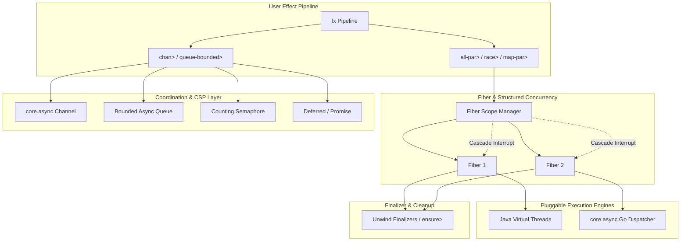

# Requirements

### Overview & Goals
`fx-async` is a first-class concurrency and parallelism module for the `fx` effect system. It bridges the native concurrency primitives of Clojure and `core.async` with modern structured concurrency patterns popularized by ZIO and Effect-TS.

The primary goals of `fx-async` are:
1. **Structured Concurrency**: Ensure parent-child lifecycle management where canceling or failing a parent fiber automatically cascades to child tasks and safely runs finalizers (`acquire-release>`, `ensure>`).
2. **Dual-Engine Execution**: Support execution on JVM threads (platform and Java Virtual Threads) as well as `core.async` go-routines.
3. **Clojure & core.async Interoperability**: Provide clean, effectful wrappers around Clojure coordination primitives (promises, delays, atoms, semaphores) and `core.async` channels (buffering, alts, pub/sub).
4. **Adherence to Repository Guidelines**: Strict canonical naming (no synonyms or aliases), standardized naming suffixes (`>` for effect constructors/combinators, `!` for runners, `?` for predicates), and monomorphic parameter contracts.

---

### Scope

#### In Scope
- **Fiber Abstraction**: Lightweight fibers with atomic lifecycle states (`:running`, `:succeeded`, `:failed`, `:interrupted`), parent-child tracking, and cancellation hooks.
- **Structured Parallel Combinators**: `fork>`, `join>`, `interrupt>`, `race>`, `all-par>`, `map-par>` with bounded concurrency controls (`{:concurrency n}`).
- **Execution Scopes**: `with-virtual-threads>`, `with-thread-pool>`, and `with-go>` context providers.
- **`core.async` Channel Integration**: `chan>`, `chan-put>`, `chan-take>`, `chan-close>`, `chan-alts>`, `chan-pipe>`, `chan-drain>`.
- **Async Queue & Hub**: Bounded/sliding/dropping `Queue` and broadcast `Hub` primitives for high-performance in-memory messaging.
- **Coordination & Synchronization**: `deferred>`, `semaphore>`, `countdown-latch>`, and `ref>`.
- **Runners**: `run-fiber!` and `run-async-chan!`.

#### Out of Scope
- Distributed clustering or actor remoting (out of scope for local async runtime).
- Custom OS thread scheduler implementations (delegates directly to Java `ForkJoinPool`, `Executors.newVirtualThreadPerTaskExecutor()`, or `core.async` thread pools).
- Deprecated alias variants (strictly canonical naming only).

---

### User Stories
- **As an FX application developer**, I want to run independent effect pipelines concurrently using `all-par>` and `map-par>` with bounded concurrency so that batch jobs complete faster without overwhelming database connection pools or external APIs.
- **As a backend engineer**, I want to race multiple external services or apply timeouts using `race>` so that slow or unresponsive requests are immediately cancelled without leaking background threads or socket descriptors.
- **As a systems programmer**, I want to use `core.async` channels and ZIO-style `Queue` / `Hub` within `fx` effect chains so that stream processing and event-driven architectures remain purely composable and error-handled.
- **As a library author**, I want structured cancellation that guarantees `acquire-release>` finalizers run when a parent fiber is interrupted so that database transactions and socket connections are never leaked.

---

### Functional Requirements
1. **Fiber Lifecycle**:
   - `fork>` converts an `IEffect` into an effect yielding an `IFiber`.
   - `join>` awaits a fiber's termination and returns its value, propagates its `IFailure`, or throws an exception if the fiber was cancelled.
   - `interrupt>` halts a fiber, cancels all active children in its hierarchy, and executes unwind finalizers.
2. **Parallel Combinators**:
   - `race>` accepts a collection of effects, executes them concurrently, returns the result of the first to succeed, and cancels the remaining competitors.
   - `all-par>` executes a sequence of effects in parallel and returns a vector of results. If any effect fails, by default it short-circuits (fail-fast) and interrupts peer fibers.
   - `map-par>` takes a sequence and an effect-producing function, evaluating with a concurrency cap (defaulting to available CPU cores or configured option `{:concurrency n}`).
3. **Channel & Stream Primitives**:
   - `chan>` creates and manages channel lifecycle within effect pipelines.
   - `chan-put>` and `chan-take>` park asynchronously without blocking OS threads, fully supporting fiber interruption.
   - `chan-alts>` allows selecting across multiple channel ports and timeout channels.
4. **Coordination Primitives**:
   - `deferred>` allows single-write multiple-read promise resolution.
   - `semaphore>` controls access to finite resources with `with-permit>`.
   - `queue-bounded>` / `queue-sliding>` / `queue-dropping>` provides backpressure-aware multi-producer multi-consumer queues.

---

### Non-Functional Requirements
- **Performance**: Zero-cost abstraction overhead over native Clojure / `core.async` primitives.
- **Thread Safety**: All state transitions (fiber status, queues, latches, deferreds) must be lock-free and thread-safe using atomic primitives (`java.util.concurrent.atomic`).
- **Resource Safety**: Complete protection against thread leaks, orphaned go-routines, and unclosed channels during interruptions or unexpected exceptions.

# Technical Design

### Current Implementation & Context
The repository currently provides:
- `fx.core`: Synchronous and asynchronous runtime (`run-sync!`, `run-async!`), effect definitions (`succeed>`, `fail>`, `try>`, `map>`, `mapcat>`, `catch>`, `catchall>`, `acquire-release>`, `ensure>`), and stack unwinding via `IUnwindable`.
- `fx.http-client`, `fx.jdbc`, `fx.ring`, `fx.observability`, `fx.schedule`: Domain and integration modules.
- Currently, concurrency in `fx.core` is limited to basic `run-async!` returning `CompletableFuture` / `Promise`, without structured fiber hierarchies, `race>`, `all-par>`, or `core.async` channel combinators.

---

### Key Decisions
1. **Multi-Engine Execution Support**:
   - Support both JVM thread pools (Platform and Virtual Threads) and `core.async` go-routines via execution scope combinators (`with-virtual-threads>`, `with-thread-pool>`, `with-go>`).
   - *Rationale*: Allows users to choose virtual threads for I/O-heavy workloads and `core.async` channels for CSP-style pipeline coordination.
2. **Hybrid Structured Cancellation**:
   - Fibers maintain an atomic status flag, cascade cancellations to all child fibers, trigger thread interruption / channel closing, and execute stack unwinding finalizers.
   - *Rationale*: Guarantees that neither blocking JVM calls nor `core.async` parked channels hang indefinitely when interrupted.
3. **Strict Guideline Compliance**:
   - Canonical names only (`acquire-release>`, `fork>`, `join>`, `race>`, `all-par>`, `map-par>`, `chan-put>`, `chan-take>`).
   - Standardized suffixes (`>` for effects, `!` for runners, `?` for predicates).
   - Monomorphic parameter types (no polymorphic dynamic coercion).

---

### Architecture & Interaction Diagram



---

### Data Models & Protocols

```clojure
(defprotocol IFiber
  (fiber-id [this] "Returns the unique ID of the fiber.")
  (fiber-status [this] "Returns an atom containing current status: :running | :succeeded | :failed | :interrupted")
  (fiber-result [this] "Returns a CompletableFuture or promise holding the fiber outcome.")
  (fiber-children [this] "Returns atom containing child fiber references.")
  (-interrupt! [this] "Interrupts the fiber and its descendants."))

(defprotocol IQueue
  (-offer! [this item] "Puts item into queue; returns true or parks if bounded.")
  (-take! [this] "Takes item from queue or parks.")
  (-size [this] "Returns current number of elements.")
  (-shutdown! [this] "Closes the queue and wakes pending takes/offers."))

(defprotocol ISemaphore
  (-acquire! [this n] "Acquires n permits, parking if unavailable.")
  (-release! [this n] "Releases n permits.")
  (-available-permits [this] "Returns count of available permits."))
```

---

### Components & Module Structure

#### 1. `fx.async` (`modules/fx-async/src/fx/async.cljc`)
Primary public entrypoint providing canonical combinators:
- **Fiber Primitives**: `fork>`, `join>`, `interrupt>`, `fiber?`, `fiber-status>`
- **Structured Parallelism**: `race>`, `all-par>`, `map-par>`
- **Execution Scopes**: `with-virtual-threads>`, `with-thread-pool>`, `with-go>`
- **Runners**: `run-fiber!`, `run-async-chan!`

#### 2. `fx.async.channel` (`modules/fx-async/src/fx/async/channel.cljc`)
`core.async` channel integration:
- `chan>`, `chan-put>`, `chan-take>`, `chan-close>`, `chan-alts>`, `chan-pipe>`, `chan-drain>`

#### 3. `fx.async.coordination` (`modules/fx-async/src/fx/async/coordination.cljc`)
High-level synchronization and queueing:
- **Queues & Hubs**: `queue-bounded>`, `queue-unbounded>`, `queue-sliding>`, `queue-dropping>`, `hub-bounded>`, `hub-publish>`, `hub-subscribe>`
- **Coordination**: `deferred>`, `deferred-succeed>`, `deferred-fail>`, `deferred-await>`, `semaphore>`, `with-permit>`, `countdown-latch>`, `ref>`

---

### File Structure
```
modules/fx-async/
├── deps.edn
├── README.md
├── src/
│   └── fx/
│       ├── async.cljc
│       └── async/
│           ├── protocols.cljc
│           ├── fiber.cljc
│           ├── channel.cljc
│           └── coordination.cljc
└── test/
    └── fx/
        └── async/
            ├── fiber_test.cljc
            ├── parallel_test.cljc
            ├── channel_test.cljc
            └── coordination_test.cljc
```

# Testing

### Validation Approach
Verification of `fx-async` involves comprehensive unit testing, concurrent stress testing, race condition checking, cancellation verification, and integration validation against the example application.

---

### Key Scenarios
1. **Fiber Fork & Join**:
   - Spawning sub-effects via `fork>` returns a valid `IFiber`.
   - Calling `join>` on a running fiber yields the expected success value or propagates failure.
2. **Structured Parallelism (`all-par>` & `map-par>`)**:
   - Multiple parallel effects execute concurrently on worker pools.
   - Respects concurrency limits: `map-par>` with `{:concurrency 2}` across 10 items executes at most 2 tasks simultaneously.
   - Results are collected in identical original order.
3. **Racing (`race>`)**:
   - Returns the fastest successful effect.
   - The losing effects are immediately interrupted and their resources released.
4. **Channel Operations**:
   - `chan-put>` and `chan-take>` seamlessly transfer values across fibers.
   - `chan-alts>` handles multiple input ports and timeout triggers accurately.
5. **Coordination Primitives**:
   - `semaphore>` strictly limits access to protected sections with `with-permit>`.
   - `queue-bounded>` applies backpressure and blocks/parks producers when buffer is full.
   - `deferred>` resolves multiple awaiting fibers upon single resolution.

---

### Edge Cases & Failure Scenarios
1. **Hierarchical Cancellation Cascade**:
   - Interrupting a parent fiber must interrupt all spawned child fibers and sub-children.
   - Verify that `acquire-release>` and `ensure>` finalizers execute reliably during fiber interruption.
2. **Fail-Fast Error Handling in `all-par>`**:
   - When 1 out of N effects fails, `all-par>` immediately yields the failure and cancels the remaining N-1 active fibers.
3. **Channel Teardown under Interruption**:
   - Canceling a fiber parked on `chan-take>` or `chan-put>` cleanly unregisters the callback without leaking channel buffers.
4. **Thread Interruption vs Virtual Thread Parking**:
   - Ensure blocking I/O and non-blocking go-routines both respond to cancellation signals appropriately.

# Delivery Steps

### ✓ Step 1: Initialize module structure, dependencies, and Fiber protocols
The `modules/fx-async` module directory, Maven/CLI dependency manifest `deps.edn`, and core protocol definitions for fibers and concurrency runtimes are fully established.

- Create `modules/fx-async/deps.edn` specifying dependencies on `fx/core` and `org.clojure/core.async`.
- Define core async protocols (`IFiber`, `ISubscription`, `IQueue`, `ICoordination`) in `modules/fx-async/src/fx/async/protocols.cljc`.
- Define Fiber records (`Fiber`) tracking fiber ID, atomic status (`:running`, `:succeeded`, `:failed`, `:interrupted`), parent-child hierarchy, cancellation listeners, and result/failure state.
- Implement fiber lifecycle helpers and runtime execution runners (`run-fiber!`, `run-async-chan!`).
- Add root alias configuration in root `deps.edn` to register `fx/async`.

### ✓ Step 2: Implement Fiber lifecycle and structured parallel combinators
Canonical effect combinators for structured concurrency (fork/join, race, parallel mapping, and execution scope configurations) are implemented and integrated with the fx runtime.

- Implement `fork>` effect constructor to spawn sub-effects into background child fibers.
- Implement `join>` effect combinator to synchronously or asynchronously await fiber completion and propagate results or errors.
- Implement `interrupt>` effect to trigger structured cancellation and cleanup finalizers across fiber scopes.
- Implement `race>` effect combinator racing multiple effects and cancelling slower branches upon first successful completion.
- Implement `all-par>` effect combinator running heterogeneous effect collections concurrently with configurable error accumulation and fail-fast options.
- Implement `map-par>` effect combinator applying an effectful transform across sequences with configurable concurrency limits (`{:concurrency n}`).
- Implement executor scoping combinators `with-virtual-threads>`, `with-thread-pool>`, and `with-go>` to control underlying execution engines.

### ✓ Step 3: Implement core.async channel bridging and stream combinators
First-class Clojure core.async channel bridging combinators and pub/sub message routing effects are available in effect pipelines.

- Implement `chan>` effect constructor supporting buffer strategies (fixed, sliding, dropping) and transducers.
- Implement `chan-put>` and `chan-take>` effect combinators with non-blocking parking and fiber cancellation safety.
- Implement `chan-alts>` effect combinator for racing inputs/outputs across multiple channels with optional timeout.
- Implement `chan-drain>` and `chan-pipe>` effect combinators for stream consumption into Clojure sequences and target channels.
- Implement `chan-close>` effect combinator for safe channel teardown.
- Implement pub/sub event broadcasting effects (`chan-pub>`, `chan-sub>`).

### ✓ Step 4: Implement async coordination and synchronization primitives
High-level async coordination and synchronization primitives (Queues, Hubs, Deferreds, Semaphores, Latches, and Refs) are implemented.

- Implement bounded and unbounded effect queues (`queue-bounded>`, `queue-unbounded>`, `queue-sliding>`, `queue-dropping>`) with `queue-offer>`, `queue-take>`, and `queue-size>`.
- Implement publish-subscribe Hubs (`hub-bounded>`, `hub-publish>`, `hub-subscribe>`) for multi-consumer effect streaming.
- Implement single-assignment async cells (`deferred>`, `deferred-succeed>`, `deferred-fail>`, `deferred-await>`).
- Implement counting semaphores (`semaphore>`, `semaphore-acquire>`, `semaphore-release>`, `with-permit>`) for rate-limiting and resource governance.
- Implement synchronization latches (`countdown-latch>`, `latch-count-down>`, `latch-await>`) and atomic effect state cells (`ref>`, `ref-get>`, `ref-set>`, `ref-update>`).

### ✓ Step 5: Add test suite, generative tests, and example application integration
Comprehensive test suites and end-to-end examples validating concurrency, fiber cancellation, race conditions, channel bridging, and resource safety are completed.

- Write unit tests in `modules/fx-async/test/fx/async/fiber_test.cljc` testing fiber fork, join, interrupt, and nested scope finalizers.
- Write unit tests in `modules/fx-async/test/fx/async/parallel_test.cljc` testing `race>`, `all-par>`, and `map-par>` under normal and failure/interruption conditions.
- Write unit tests in `modules/fx-async/test/fx/async/channel_test.cljc` validating `core.async` channel integration, parking, buffers, and timeouts.
- Write unit tests in `modules/fx-async/test/fx/async/coordination_test.cljc` validating Queue, Hub, Deferred, Semaphore, and Latch invariants.
- Add an example use case in `example/src/todo/worker.clj` showcasing background workers, parallel import batching, and channel notifications.