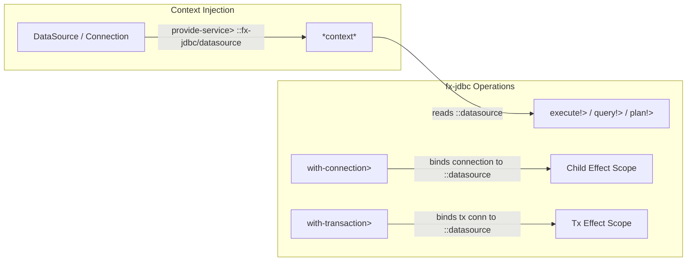

# Requirements

### Overview & Goals
Transition implicit context connectable resolution across the `fx-jdbc` module from the unqualified keyword `:db` to the canonical namespaced keyword `::datasource` (`:com.lambdaseq.fx.jdbc/datasource`). By utilizing a fully namespaced context key and enforcing strict namespaced resolution without unqualified fallbacks, we eliminate potential context key collisions with other libraries or domain dependencies, enhance pipeline clarity, and establish clean, modular dependency injection boundaries.

### Scope
- **In Scope:**
  - Update `com.lambdaseq.fx.jdbc` connectable resolution helper `resolve-connectable` to extract `::datasource` (`:com.lambdaseq.fx.jdbc/datasource`) from `*context*`.
  - Update `com.lambdaseq.fx.jdbc.sql` target resolution helper `resolve-target` to extract `:com.lambdaseq.fx.jdbc/datasource` from `*context*`.
  - Update `with-connection>` and `with-transaction>` (via `run-tx-on-conn>`) to bind scoped connections to `::datasource` in `*context*` via `(fx/provide-service> ::datasource conn ...)`.
  - Update `missing-connectable-error` message to reference `::datasource` / `:com.lambdaseq.fx.jdbc/datasource`.
  - Update `modules/fx-jdbc/test/com/lambdaseq/fx/jdbc_test.clj` context-injection tests to supply `::fx-jdbc/datasource` (or `:com.lambdaseq.fx.jdbc/datasource`).
  - Refactor SQLite integration tests in `modules/fx-jdbc/test/com/lambdaseq/fx/jdbc_test.clj` to use top-level `(is ...)` assertions on evaluated results and include transaction commit/rollback verification.
- **Out of Scope:**
  - Modifying the core effect runtime in `modules/fx-core`.
  - Adding multiple non-canonical alias keys or polymorphic key dispatch mechanisms.

### User Stories
- **As an Effect Pipeline Author**, I want database operations to resolve their connectable from `:com.lambdaseq.fx.jdbc/datasource` in context so that database dependencies do not collide with user-level domain state or other module keys in `*context*`.
- **As a Test Author**, I want to provide test datasources via `(fx/provide-service> ::fx-jdbc/datasource test-ds)` and have all downstream queries and transactions automatically execute against that datasource.
- **As a System Maintainer**, I want clear error feedback indicating missing `:com.lambdaseq.fx.jdbc/datasource` when no connectable is supplied.

### Functional Requirements
1. **Namespaced Context Key Resolution:**
   - Database operations (`execute!>`, `execute-one!>`, `plan!>`, `prepare-statement>`, `with-prepared-statement>`, and `sql/*`) must check `::datasource` (`:com.lambdaseq.fx.jdbc/datasource`) in `*context*` when an explicit connectable is not passed as an argument or received from an upstream effect.
   - Unqualified `:db` is strictly ignored to eliminate collision risks.
2. **Context Scoping in Brackets and Transactions:**
   - `with-connection>` binds the acquired `java.sql.Connection` to `::datasource` for child effects using `(fx/provide-service> ::datasource conn eff)`.
   - `with-transaction>` binds the active transactional connection to `::datasource` throughout the transactional sub-pipeline.
3. **Structured Failure on Missing Connectable:**
   - If no explicit connectable is provided and `::datasource` is absent from context, return an `IFailure` with tag `:jdbc/missing-connectable` and message `"No connectable provided and ::datasource not found in context"`.
4. **Integration Test Suite Verification:**
   - All tests in `modules/fx-jdbc/test/com/lambdaseq/fx/jdbc_test.clj` run against H2 and SQLite using `::fx-jdbc/datasource` context injection.
   - All test assertions execute at top level against `fx/run-sync!` results.

### Non-Functional Requirements
- **Strict Canonical Conventions:** Consistent use of `::datasource` (which expands to `:com.lambdaseq.fx.jdbc/datasource` within the namespace).
- **Zero Runtime Overhead:** Context lookups use direct map access on Clojure's dynamic context map.

# Technical Design

### Current Implementation
In `modules/fx-jdbc/src/com/lambdaseq/fx/jdbc.clj` and `modules/fx-jdbc/src/com/lambdaseq/fx/jdbc/sql.clj`:
- Connectable resolution checks `(:db ctx)`.
- Connection scoping binds `(fx/provide-service> :db conn eff)`.
- Failure reporting states `":db not found in context"`.
- Tests in `modules/fx-jdbc/test/com/lambdaseq/fx/jdbc_test.clj` use `(fx/provide-service> :db ds)` and `{:db ds}`.

### Key Decisions
1. **Uniform Namespaced Key (`::datasource` / `:com.lambdaseq.fx.jdbc/datasource`):**
   - *Chosen Approach:* Use `:com.lambdaseq.fx.jdbc/datasource` uniformly across all JDBC operations for both ambient datasources and scoped connection instances.
   - *Rationale:* Maximizes system utility by preventing key namespace collisions, maintaining single-key consistency, and preserving point-free pipeline composability.
2. **Strict Namespaced Enforcement:**
   - *Chosen Approach:* Do not fall back to unqualified `:db`.
   - *Rationale:* Eliminates ambiguity, prevents accidental binding to unrelated `:db` values in the application, and enforces clean modular boundaries.

### Architecture & Data Flow



### Components & Code Changes

#### 1. `com.lambdaseq.fx.jdbc`
- Update `missing-connectable-error`:
  ```clojure
  (defn missing-connectable-error []
    (fx/make-failure :jdbc/missing-connectable
                     {:message "No connectable provided and ::datasource not found in context"}))
  ```
- Update `resolve-connectable`:
  ```clojure
  (defn- resolve-connectable [explicit-conn upstream-val ctx]
    (or explicit-conn
        (when (and (some? upstream-val) (not (fx/failure? upstream-val)) (connectable? upstream-val))
          upstream-val)
        (::datasource ctx)))
  ```
- Update `with-connection>`:
  ```clojure
  (defn with-connection>
    ([use-eff-fn]
     (with-connection> nil nil use-eff-fn))
    ([connectable use-eff-fn]
     (with-connection> connectable nil use-eff-fn))
    ([connectable opts use-eff-fn]
     (fx/acquire-release>
       (get-connection> connectable opts)
       (fn [conn]
         (let [eff (use-eff-fn conn)]
           (fx/provide-service> ::datasource conn eff)))
       (fn [conn]
         (close-connection> conn)))))
  ```
- Update `run-tx-on-conn>`:
  ```clojure
  (defn- run-tx-on-conn> [^Connection conn opts tx-eff-fn]
    (fx/acquire-release>
      (fx/map> (fn [_] (begin-tx! conn opts)))
      (fn [tx-state]
        (-> (tx-eff-fn conn)
            (fx/provide-service> ::datasource conn)
            (fx/match>
              (fn [failure-val]
                (rollback-tx! tx-state)
                failure-val)
              (fn [success-val]
                (if (:rollback-only opts)
                  (do
                    (rollback-tx! tx-state)
                    success-val)
                  (do
                    (commit-tx! tx-state)
                    success-val))))))
      (fn [tx-state]
        (fx/map> (fn [_] (cleanup-tx-state! tx-state))))))
  ```

#### 2. `com.lambdaseq.fx.jdbc.sql`
- Update `resolve-target`:
  ```clojure
  (defn- resolve-target [explicit-conn upstream-val ctx]
    (or explicit-conn
        (when (and (some? upstream-val) (not (fx/failure? upstream-val)) (connectable? upstream-val))
          upstream-val)
        (:com.lambdaseq.fx.jdbc/datasource ctx)))
  ```

#### 3. `modules/fx-jdbc/test/com/lambdaseq/fx/jdbc_test.clj`
- Replace all instances of `(fx/provide-service> :db ds ...)` and `{:db ds}` with `(fx/provide-service> ::fx-jdbc/datasource ds ...)` and `{::fx-jdbc/datasource ds}`.
- Refactor SQLite integration tests to extract results from `fx/run-sync!` and assert directly with top-level `(is ...)` forms, including transaction rollback and commit tests.

### File Structure
- `modules/fx-jdbc/src/com/lambdaseq/fx/jdbc.clj` (modified)
- `modules/fx-jdbc/src/com/lambdaseq/fx/jdbc/sql.clj` (modified)
- `modules/fx-jdbc/test/com/lambdaseq/fx/jdbc_test.clj` (modified)

# Testing

### Validation Approach
Execute the test suite using `clojure -T:build test` across all modules (`fx-core`, `fx-typed`, `fx-jdbc`), verifying that:
1. Connectable resolution correctly finds `::fx-jdbc/datasource` injected in context.
2. Omission of `::fx-jdbc/datasource` in context yields `:jdbc/missing-connectable`.
3. Scoped connections and transactions properly propagate `::datasource` to inner effects.
4. SQLite and H2 test cases pass with deterministic top-level assertions.

### Key Scenarios
1. **Context-Aware Query Execution:**
   - Execute query with `(fx/provide-service> ::fx-jdbc/datasource ds)` and confirm successful execution without explicit connection parameter.
2. **Context-Aware CRUD Execution:**
   - Execute `sql/insert!>`, `sql/query!>`, `sql/update!>`, `sql/delete!>` relying on ambient `::fx-jdbc/datasource`.
3. **Missing Connectable Failure:**
   - Execute `execute!>` without arguments and empty context; verify `:jdbc/missing-connectable` failure is returned.
4. **Nested Transactions and Scoped Connections:**
   - Verify `with-connection>` and `with-transaction>` provide the active connection as `::datasource` to child queries.
5. **SQLite Test Assertions:**
   - Verify all SQLite CRUD and transaction assertions run deterministically at the top level.

# Delivery Steps

### ✓ Step 1: Update connectable resolution and context provision to use namespaced ::datasource
Migrate `com.lambdaseq.fx.jdbc` and `com.lambdaseq.fx.jdbc.sql` from `:db` to `::datasource` (`:com.lambdaseq.fx.jdbc/datasource`).

- Update `resolve-connectable` in `com.lambdaseq.fx.jdbc` to read `(::datasource ctx)`.
- Update `with-connection>` and `run-tx-on-conn>` in `com.lambdaseq.fx.jdbc` to bind connections to `::datasource` via `provide-service>`.
- Update `missing-connectable-error` in `com.lambdaseq.fx.jdbc` to reference `::datasource`.
- Update `resolve-target` in `com.lambdaseq.fx.jdbc.sql` to read `(:com.lambdaseq.fx.jdbc/datasource ctx)`.

### ✓ Step 2: Update test suite to use namespaced context keys and verify SQLite assertions
All integration tests use `::fx-jdbc/datasource` and assert deterministically on execution results.

- Update context injection test cases in `modules/fx-jdbc/test/com/lambdaseq/fx/jdbc_test.clj` to supply `::fx-jdbc/datasource` and `{::fx-jdbc/datasource ds}`.
- Refactor the SQLite integration test block in `modules/fx-jdbc/test/com/lambdaseq/fx/jdbc_test.clj` to evaluate pipelines with `fx/run-sync!` and assert using top-level `(is ...)` forms for both CRUD and transactional rollback/commit.
- Execute the workspace test runner via `clojure -T:build test` to verify zero failures across `fx-core`, `fx-typed`, and `fx-jdbc`.