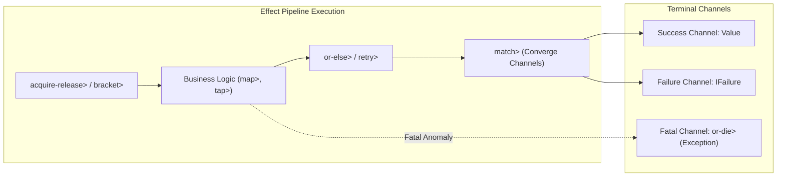

# Requirements

### Overview & Goals
The objective of this design plan is to maximize the utility, operational stability, and developer ergonomics of the `fx` effect library (`com.lambdaseq.fx.core` and `com.lambdaseq.fx.typed`). By prioritizing additions based on their return on investment (ROI)—specifically targeting defect prevention, resource leak elimination, and reduction of boilerplate—the library delivers maximum throughput and reliability for Clojure and ClojureScript systems.

### Scope
- **In Scope:**
  - **Resource Safety Primitives:** Deterministic resource acquisition and release (`acquire-release>`, `bracket>`).
  - **Defect vs. Expected Failure Isolation:** Primitives to distinguish recoverable domain failures from fatal system defects (`or-die>`, `die>`).
  - **Error Ergonomics & Recovery:** Bi-channel folding and resilience combinators (`match>`, `fold>`, `or-else>`, `retry>`).
  - **Collection & Composition Primitives:** First-class batch processing and tuple pairing (`traverse>`, `for-each>`, `zip>`, `zip-with>`).
  - **Asynchronous Execution & Suspension:** Non-blocking async execution (`run-async!`) and delays (`sleep>`).
  - **Type Contracts:** Corresponding Typed Clojure signatures in `com.lambdaseq.fx.typed`.
- **Out of Scope:**
  - Full fiber-based software transactional memory (STM) or heavy runtime concurrency systems.
  - Breaking changes to existing `Effect`, `Failure`, `IEffect`, or `IFailure` protocol definitions.

### User Stories
- **As a Backend Engineer**, I want guaranteed resource cleanup via `acquire-release>` so that database connections, file handles, and locks are deterministically released, eliminating resource starvation incidents in production.
- **As a Systems Architect**, I want distinct handling for domain failures and fatal defects via `or-die>` so that unexpected anomalies fail fast without corrupting system state, while business errors remain typed and recoverable.
- **As a Developer**, I want ergonomic error combinators (`match>`, `or-else>`, `retry>`) and collection combinators (`for-each>`, `zip>`) so that branching, fallback, and batch workflows require minimal boilerplate.

### Functional Requirements
1. **Resource Lifecycle:** `acquire-release>` must guarantee that if acquisition succeeds, the release effect executes regardless of whether the usage effect succeeds, fails, or throws.
2. **Defect Management:** `die>` must raise an uncatchable defect; `or-die>` must convert any domain `IFailure` into a fatal defect.
3. **Channel Convergence:** `match>` must evaluate failure and success handlers respectively, returning a single merged success value.
4. **Resilience Policies:** `retry>` must support fixed delays, exponential backoffs, max attempt counts, and predicate checks.
5. **Collection Processing:** `for-each>` / `traverse>` must execute an effectful mapping across a collection, returning a vector of results or short-circuiting on the first failure.
6. **Async Support:** `run-async!` must evaluate effect pipelines asynchronously across thread pools/virtual threads (JVM) and Promises (JS).

### Non-Functional Requirements
- **Zero-Overhead Abstractions:** Pipeline composition should avoid redundant allocations and maintain point-free threading support.
- **Cross-Platform Compatibility:** All new core combinators must operate consistently across Clojure (JVM) and ClojureScript.
- **Type Safety:** Typed Clojure annotations must accurately reflect input, output, failure union types, and context requirements.

# Technical Design

### Current Implementation & Architecture Baseline
The library represents computations as chained `Effect` records implementing `IEffect` (`-eval!`, `prev-effect`) and `ITagged` (`tag`). Errors are represented by `Failure` records implementing `IFailure` (`error-data`) and `ITagged` (`tag`).
Pipeline execution is orchestrated via `run-sync!`, which traverses upstream dependencies via `prev-effect`, reverses the chain, and folds execution from root to leaf passing values and propagating failures via `maybe-propagate-failure`.

### Key Architectural Decisions & Utility Rationale
1. **Separation of Domain Failures and Fatal Defects:**
   - *Decision:* Maintain domain errors within the `IFailure` channel, while defects (unhandled exceptions, system invariants) are elevated via `die>` / `or-die>` as thrown exceptions or fatal defect wrappers.
   - *Rationale:* Maximizes system reliability by preventing fatal logic/runtime errors from being accidentally caught by generic domain error recovery.
2. **Deterministic Cleanup Semantics:**
   - *Decision:* Build `acquire-release>` on top of guaranteed evaluation semantics where the release effect receives the acquired resource and always executes if acquisition succeeded.
   - *Rationale:* Eliminates connection and memory leaks with minimal cognitive overhead.
3. **Composable Retry Policies:**
   - *Decision:* Implement `retry>` with data-driven configuration maps (`:max-attempts`, `:delay-ms`, `:backoff-factor`, `:retry-if`).
   - *Rationale:* High leverage for distributed systems handling transient network failures without duplicating retry loops.

### Proposed Additions & Design Revisions

#### 1. Resource Safety: `acquire-release>` / `bracket>`
```clojure
(defn acquire-release>
  "Acquires a resource, runs `use-eff-fn`, and guarantees `release-eff-fn` executes
   if acquisition succeeded, regardless of usage outcome."
  ([acquire-eff use-eff-fn release-eff-fn]
   (make-effect :acquire-release nil
     (fn [_]
       (let [resource (-run! acquire-eff)]
         (if (failure? resource)
           resource
           (let [use-eff (use-eff-fn resource)
                 release-eff (release-eff-fn resource)]
             (try
               (let [use-res (-run! (chain> (succeed> resource) use-eff))]
                 (let [rel-res (-run! (chain> (succeed> resource) release-eff))]
                   (if (failure? rel-res) rel-res use-res)))
               (catch #?(:clj Throwable :cljs :default) e
                 (-run! (chain> (succeed> resource) release-eff))
                 (throw e))))))))))
```

#### 2. Defect Separation: `die>` and `or-die>`
```clojure
(defn die>
  "Yields an effect that halts execution by throwing a fatal defect exception."
  [err]
  (make-effect :die nil
    (fn [_]
      (throw (ex-info "Effect defect encountered" {:defect err})))))

(defn or-die>
  "Converts any upstream domain failure into a fatal defect exception."
  ([prev-effect]
   (make-effect :or-die prev-effect
     (fn [value]
       (if (failure? value)
         (throw (ex-info "Effect terminated with fatal defect" (failure->value value)))
         value)))))
```

#### 3. Error Ergonomics: `match>`, `or-else>`, and `retry>`
- **`match>` / `fold>`:**
  ```clojure
  (defn match>
    "Converges failure and success channels by applying `on-failure` or `on-success`."
    ([prev-effect on-failure on-success]
     (make-effect :match prev-effect
       (fn [value]
         (if (failure? value)
           (on-failure value)
           (on-success value))))))
  ```
- **`or-else>`:**
  ```clojure
  (defn or-else>
    "Executes `fallback-effect` if upstream evaluates to a failure."
    ([prev-effect fallback-effect]
     (make-effect :or-else prev-effect
       (fn [value]
         (if (failure? value)
           (-run! (chain> (succeed> (error-data value)) fallback-effect))
           value)))))
  ```
- **`retry>`:**
  ```clojure
  (defn retry>
    "Retries an effect according to policy {:max-attempts n :delay-ms ms :backoff-factor f}."
    ([target-effect policy]
     (make-effect :retry nil
       (fn [value]
         (loop [attempt 1
                curr-delay (:delay-ms policy 0)]
           (let [res (-run! (if (some? value) (chain> (succeed> value) target-effect) target-effect))]
             (if (and (failure? res)
                      (< attempt (:max-attempts policy 3))
                      (if-let [pred (:retry-if policy)] (pred res) true))
               (do
                 #?(:clj (Thread/sleep curr-delay))
                 (recur (inc attempt) (long (* curr-delay (:backoff-factor policy 1.0)))))
               res)))))))
  ```

#### 4. Collection Primitives: `for-each>` / `traverse>` & `zip-with>`
- **`for-each>` / `traverse>`:**
  ```clojure
  (defn for-each>
    "Maps a collection through an effect-producing function and collects results."
    [coll f-eff]
    (make-effect :for-each nil
      (fn [_]
        (reduce (fn [acc item]
                  (let [res (-run! (f-eff item))]
                    (if (failure? res)
                      (reduced res)
                      (conj acc res))))
                []
                coll))))
  ```
- **`zip-with>` / `zip>`:**
  ```clojure
  (defn zip-with>
    "Evaluates two independent effects and combines their results with `f`."
    [eff-a eff-b f]
    (make-effect :zip-with nil
      (fn [_]
        (let [res-a (-run! eff-a)]
          (if (failure? res-a)
            res-a
            (let [res-b (-run! eff-b)]
              (if (failure? res-b)
                res-b
                (f res-a res-b))))))))

  (defn zip> [eff-a eff-b] (zip-with> eff-a eff-b vector))
  ```

#### 5. Asynchronous Execution: `run-async!` & `sleep>`
```clojure
(defn sleep>
  "Suspends evaluation for `ms` milliseconds."
  [ms]
  (make-effect :sleep nil
    (fn [v]
      #?(:clj (Thread/sleep ms)
         :cljs nil) ;; handoff to async timer
      v)))

(defn run-async!
  "Evaluates effect pipeline asynchronously."
  ([effect] (run-async! effect {}))
  ([effect context]
   #?(:clj (java.util.concurrent.CompletableFuture/supplyAsync
            (reify java.util.function.Supplier
              (get [_] (run-sync! effect context))))
      :cljs (js/Promise. (fn [resolve reject]
                           (try
                             (resolve (run-sync! effect context))
                             (catch :default e (reject e))))))))
```

### Architecture Diagram


### File Structure & Affected Namespaces
- `modules/fx-core/src/com/lambdaseq/fx/core.cljc`: Implementation of core combinators.
- `modules/fx-core/test/com/lambdaseq/fx/core_test.cljc`: Core unit and regression tests.
- `modules/fx-typed/src/com/lambdaseq/fx/typed.cljc`: Typed Clojure contracts for all new combinators.
- `modules/fx-typed/test/com/lambdaseq/fx/typed_test.cljc`: Type validation suites.

### Risks & Mitigations
- **Exception Interception in Finalizers:** An unhandled exception in a release effect could mask a usage failure.
  - *Mitigation:* Catch and report composite failures or ensure release execution completes before propagating primary failure.
- **Platform Sleep Blocking on Single Thread in CLJS:** Synchronous sleeping blocks JavaScript runtime.
  - *Mitigation:* Ensure `sleep>` evaluates within `run-async!` using `js/setTimeout` promises on CLJS.

# Testing

### Validation Approach
Automated testing in `fx-core-test` and `fx-typed-test` will validate functional correctness, short-circuit semantics, failure channel propagation, and static type specifications across both Clojure and ClojureScript.

### Key Scenarios
1. **Resource Cleanup Verification (`acquire-release>`):**
   - Resource acquired $\rightarrow$ usage succeeds $\rightarrow$ release executes $\rightarrow$ returns usage result.
   - Resource acquired $\rightarrow$ usage fails with `IFailure` $\rightarrow$ release executes $\rightarrow$ returns original `IFailure`.
   - Resource acquired $\rightarrow$ usage throws exception $\rightarrow$ release executes $\rightarrow$ exception propagated.
   - Resource acquisition fails $\rightarrow$ usage and release do not execute $\rightarrow$ returns acquisition failure.
2. **Defect Coercion (`or-die>`):**
   - Upstream success $\rightarrow$ passes value unmodified.
   - Upstream failure $\rightarrow$ throws `ExceptionInfo` containing failure tag and error data.
3. **Channel Convergence (`match>`):**
   - Upstream success $\rightarrow$ calls success branch $\rightarrow$ yields mapped value.
   - Upstream failure $\rightarrow$ calls failure branch $\rightarrow$ yields recovered value.
4. **Resilience & Backoff (`retry>`):**
   - Transient failure $\rightarrow$ retries until max attempts or success, respecting delay and backoff factor.
   - Persistent failure $\rightarrow$ retries exhausted $\rightarrow$ yields final failure.
5. **Collection Mapping (`for-each>`):**
   - Non-empty collection $\rightarrow$ evaluates each item $\rightarrow$ returns aggregated vector.
   - Collection containing a failure $\rightarrow$ short-circuits immediately without evaluating subsequent elements.
6. **Asynchronous Execution (`run-async!`):**
   - Completes successfully offloading to thread pool/CompletableFuture without blocking main thread.

### Edge Cases & Regression Protection
- **Empty Collections in `for-each>`:** Returns empty vector `[]` immediately without evaluating functions.
- **Nil Values:** Ensure `succeed>` with `nil` does not trigger failure or short-circuit branches in `match>` or `zip>`.
- **Nested Dynamic Contexts:** Ensure `provide>` and `provide-service>` propagate cleanly through `acquire-release>` and `for-each>` loops.

# Delivery Steps

### ✓ Step 1: Implement Resource Safety and Defect Isolation Primitives
Resource management and defect containment primitives guarantee leak-free execution and distinct separation between domain failures and fatal defects.

- Implement `acquire-release>` (and `bracket>`) in `com.lambdaseq.fx.core`, ensuring deterministic acquisition, usage, and release semantics where release is guaranteed if acquisition succeeds.
- Implement `die>` and `or-die>` to convert expected domain failures or fatal anomalies into unhandled runtime defects, preventing corrupt state propagation.
- Enhance `try>` to provide seamless exception-to-failure coercion with customizable failure tags and typed defect mapping.
- Add comprehensive unit tests in `com.lambdaseq.fx.core-test` verifying cleanup execution on both successful and aborted pipelines.

### ✓ Step 2: Implement Error Ergonomics and Resilience Combinators
Error handling combinators allow developers to converge branching channels, apply fallback logic, and recover from transient faults with minimal cognitive overhead.

- Implement `match>` / `fold>` to converge both success and failure channels into a single unified effect result.
- Implement `or-else>` and `or-else-fail>` to execute fallback effects upon upstream failure.
- Implement `retry>` with configurable backoff policies (fixed delay, exponential backoff, maximum attempts, and predicate filters).
- Add unit tests in `com.lambdaseq.fx.core-test` covering fallback resolution, retry exhaustions, and matched channel convergence.

### ✓ Step 3: Implement Collection and Composition Combinators
Collection and tuple combinators streamline batch processing and multi-effect composition without nesting boilerplate.

- Implement `for-each>` / `traverse>` to map collections through effect-returning functions with short-circuit failure propagation.
- Implement `zip>` and `zip-with>` to combine independent effects into pairs or combine them using a binary function.
- Optimize evaluation to avoid intermediate allocations during pipeline composition.
- Add test coverage in `com.lambdaseq.fx.core-test` validating sequence evaluation, empty collections, and short-circuit failure handling.

### ✓ Step 4: Implement Asynchronous Runtime and Typed Contracts
The effect runtime supports non-blocking asynchronous execution across JVM/JS and exposes Typed Clojure annotations for all new combinators.

- Implement `run-async!` (supporting CompletableFuture/Virtual Threads on JVM and Promises on ClojureScript) and `sleep>` for non-blocking suspension.
- Update `com.lambdaseq.fx.typed` with type annotations (`t/ann`) for all new combinators (`acquire-release>`, `or-die>`, `match>`, `or-else>`, `retry>`, `for-each>`, `zip>`, `run-async!`).
- Add integration tests in `com.lambdaseq.fx.typed-test` validating Typed Clojure type checking and asynchronous pipeline execution.