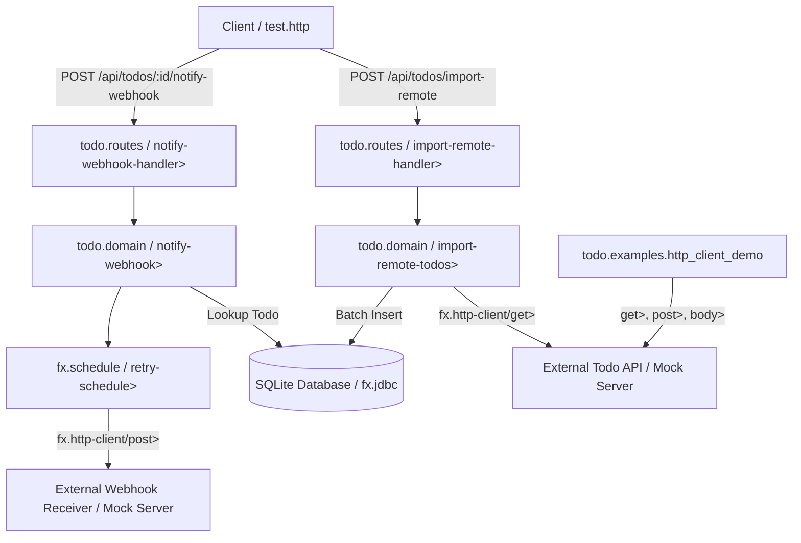

# Requirements

### Overview & Goals
The goal of this initiative is to enrich the `example` subproject (`todo` application) with comprehensive, practical examples demonstrating the newly introduced `fx-http-client` module in synergy with existing `fx` effect system libraries (`fx.core`, `fx.jdbc`, `fx.ring`, `fx.schedule`, `fx.observability`, and `fx.layer`).

This includes adding outbound HTTP capabilities to the Todo REST API (remote todo synchronization and resilient webhook dispatching), introducing managed HTTP client lifecycle layers, adding standalone runnable demonstration scripts, and documenting workflows in interactive HTTP test suites and markdown guides.

### Scope

#### In Scope
- **Dependency Integration:** Add `fx/http-client {:local/root "../modules/fx-http-client"}` to `example/deps.edn`.
- **Client Lifecycle Management:** Introduce `http-client-layer>` in `todo.main` using `fx.http-client/build-client>` and compose it into `app-layer>`.
- **Remote Todo Import API:** Add `POST /api/todos/import-remote` in `todo.routes` and `todo.domain` to fetch, validate, transform, and persist external JSON todo collections with batching and transaction rollback protection.
- **Resilient Webhook Dispatching API:** Add `POST /api/todos/:id/notify-webhook` in `todo.routes` and `todo.domain` to dispatch completion notifications to external endpoints with exponential backoff retries (`fx.schedule/retry-schedule>`) and circuit breaker protection (`fx.schedule/circuit-breaker>`).
- **HTTP Error Translation:** Expand `todo.routes/failure-map` with HTTP failure handlers for `:http/client-error`, `:http/server-error`, `:http/timeout`, and `:http/connection-error`.
- **Standalone Demonstration Namespace:** Create `todo.examples.http_client_demo` with executable `-main` demonstrating standalone GET/POST requests, response coercion (`:as :json`), concurrent fetching, retry policies, and metrics reporting.
- **Embedded Mock Test Suite:** Create `example/test/todo/external_sync_test.clj` using an embedded Sun/Jetty HTTP server fixture to verify import, webhook dispatch, retry recovery, and failure paths with zero external network reliance.
- **Documentation & Interactive Tests:** Update `example/README.md` and `example/test.http` with the new endpoints, curl/HTTP examples, and architecture diagrams.

#### Out of Scope
- Reliance on external public APIs during automated test execution.
- Modifying core library contracts or introducing non-canonical aliases.

### User Stories
- **As a developer learning `fx`**, I want to see how outbound HTTP calls (`fx.http-client`) integrate with incoming Ring requests (`fx.ring`) and database transactions (`fx.jdbc`) so that I can build real-world microservices.
- **As a distributed system engineer**, I want clear reference patterns for attaching exponential backoff retries and circuit breakers (`fx.schedule`) to external HTTP calls and mapping categorized HTTP errors (`:http/client-error`, `:http/server-error`) to appropriate HTTP status codes.
- **As a developer running local examples**, I want standalone runnable scripts and interactive `.http` files so that I can experiment with HTTP client effects directly in my editor and terminal.

### Functional Requirements
- **Remote Import (`POST /api/todos/import-remote`):**
  - Accepts JSON payload `{:url "http://..." :limit 10}`.
  - Executes GET request using `fx.http-client/get>` with `:as :json` and timeout.
  - Validates remote items, normalizes schemas, and batch-inserts valid todos into SQLite using `todo.db/create-todo!`.
  - Returns HTTP 200 with `{:imported-count n :todos [...]}` or structured failure on network/validation errors.
- **Webhook Dispatch (`POST /api/todos/:id/notify-webhook`):**
  - Accepts JSON payload `{:webhook-url "http://..."}`.
  - Fetches the specified todo by ID from SQLite.
  - Dispatches POST request with todo payload using `fx.http-client/post>`.
  - Automatically retries transient errors (`:http/server-error`, `:http/timeout`, `:http/connection-error`) using `fx.schedule/retry-schedule>`.
  - Returns HTTP 200 with `{:notified true :todo-id id :status status}` or appropriate HTTP failure (e.g. 504 on timeout, 502 on upstream failure).
- **Standalone Examples (`todo.examples.http_client_demo`):**
  - Provides a runnable entrypoint (`-main`) demonstrating:
    1. Basic JSON GET with response body extraction (`body>`).
    2. Resilient POST with exponential backoff and jitter.
    3. Ambient client context injection via `with-client>`.
    4. Integration with metrics and tracing.

### Non-Functional Requirements
- **Deterministic Testing:** 100% offline unit/integration test execution via local embedded HTTP server.
- **Canonical Naming:** Strict adherence to `>` constructors, `?` predicates, and `!` runners.
- **Zero Thread Leaks:** All client and server resources managed cleanly via `fx.layer` or test fixtures.

# Technical Design

### Current Implementation
The `example` project (`example/src/todo/`) is a full-featured REST service containing:
- `todo.main`: System lifecycle management using `fx.layer` (`metrics-layer>`, `datasource-layer>`, `worker-layer>`, `http-server-layer>`, `app-layer>`).
- `todo.routes`: Ring HTTP routes with `reitit` and `fx.ring/wrap-fx`, exposing `/api/todos` and `/api/metrics`.
- `todo.domain`: Pure effect business pipelines (`list-todos>`, `create-todo>`, `get-todo-by-id>`, `update-todo>`, `toggle-todo>`, `delete-todo>`).
- `todo.db`: HoneySQL queries and SQLite persistence over `fx.jdbc`.
- `todo.resilience`: Token bucket rate limiters and database retry policies (`fx.schedule`).
- `todo.schema`: Malli validation and coercion effects.

### Key Decisions
1. **Integrated REST Endpoints & Standalone Scripts:** Provide both in-app endpoints (`POST /api/todos/import-remote`, `POST /api/todos/:id/notify-webhook`) and standalone demo script (`todo.examples.http_client_demo`).
2. **Client Layer Management:** Add `http-client-layer>` in `todo.main` using `fx.http-client/build-client>` to inject `:fx.http-client/client` into the application context, making outbound requests ambiently configured.
3. **Resilient Outbound Dispatch:** Combine `fx.http-client/post>` with `fx.schedule/retry-schedule>` and `fx.schedule/while-tag>` matching transient network/server tags (`#{:http/server-error :http/timeout :http/connection-error}`).
4. **Embedded Mock Server for Testing:** Use local Sun `HttpServer` fixture in `example/test/todo/external_sync_test.clj` to test all scenarios without live internet connectivity.

### Architecture Diagram


### Proposed Changes

#### 1. Configuration & Dependencies
- Update `example/deps.edn` to add `fx/http-client {:local/root "../modules/fx-http-client"}`.

#### 2. Lifecycle Layers (`example/src/todo/main.clj`)
- Implement `http-client-layer>`:
```clojure
(defn http-client-layer>
  "Defines a managed HTTP client layer for fx-http-client."
  ([]
   (http-client-layer> {:connect-timeout 5000 :version :http-2}))
  ([opts]
   (fx-layer/make> :fx.http-client/client
     (http/build-client> opts)
     (fn [_client] (fx/succeed> nil)))))
```
- Update `app-layer>` to include `(http-client-layer>)`.

#### 3. Domain Logic (`example/src/todo/domain.clj`)
- Add `import-remote-todos>`:
  - Takes `{:keys [url limit]}`.
  - Executes `(http/get> url {:as :json :timeout 5000})`.
  - Normalizes received items and batch inserts into DB via `todo.db/create-todo!`.
- Add `notify-webhook>`:
  - Takes `todo-id` and `{:keys [webhook-url]}`.
  - Loads todo by ID.
  - Executes `(http/post> webhook-url {:body todo :as :json})` wrapped in `webhook-retry-policy`.

#### 4. Route Handlers & Failure Map (`example/src/todo/routes.clj`)
- Add routes:
  - `POST /api/todos/import-remote` -> `import-remote-todos-handler>`
  - `POST /api/todos/:id/notify-webhook` -> `notify-webhook-handler>`
- Update `failure-map`:
  - `:http/client-error` -> HTTP 400 / 422 with upstream details.
  - `:http/server-error` -> HTTP 502 Bad Gateway.
  - `:http/timeout` -> HTTP 504 Gateway Timeout.
  - `:http/connection-error` -> HTTP 503 Service Unavailable.

#### 5. Standalone Examples (`example/src/todo/examples/http_client_demo.clj`)
- Standalone demonstration namespace showcasing:
  - Basic GET with JSON decoding.
  - POST with retries on server errors.
  - Ambient client context binding via `with-client>`.
  - Metrics tracking on HTTP requests.

#### 6. Interactive HTTP Tests & Documentation (`example/test.http`, `example/README.md`)
- Add test requests to `example/test.http` for remote import and webhook notification.
- Update `example/README.md` with outbound HTTP client section, architecture overview, and example commands.

### Data Models / Contracts

#### Import Remote Request & Response
```clojure
;; Request POST /api/todos/import-remote
{:url "http://localhost:8080/mock-todos"
 :limit 5}

;; Response 200 OK
{:imported-count 2
 :todos [{:id 1 :title "Remote Item 1" :completed false}
         {:id 2 :title "Remote Item 2" :completed true}]}
```

#### Webhook Notification Request & Response
```clojure
;; Request POST /api/todos/1/notify-webhook
{:webhook-url "http://localhost:8080/webhook-receiver"}

;; Response 200 OK
{:notified true
 :todo-id 1
 :webhook-url "http://localhost:8080/webhook-receiver"
 :remote-status 200}
```

### Risks & Mitigations
- **Port Conflicts in Tests:** Tests might clash on hardcoded ports.
  - *Mitigation:* Use dynamic port binding (`InetSocketAddress. "127.0.0.1" 0`) for embedded HTTP mock servers.
- **Upstream Network Flakiness:** External public endpoints may be slow or unreachable.
  - *Mitigation:* Use 100% local embedded mock server in test suites and configurable URLs in runtime routes.

# Testing

### Validation Approach
Automated tests will run using Cognitect test runner via `clojure -T:build test` and the `example` test alias. All test scenarios will run against an embedded Sun/Jetty `HttpServer` fixture.

### Key Scenarios
1. **Remote Import Happy Path:** Verify importing remote items parses JSON, normalizes schema, and persists records to SQLite.
2. **Remote Import Failure Handling:** Verify handling 404/500 remote HTTP errors and mapping to appropriate client response.
3. **Webhook Dispatch with Transient Retry:** Verify webhook endpoint retries on 503 Service Unavailable, succeeds on subsequent attempt, and returns 200.
4. **Webhook Dispatch Failure:** Verify webhook endpoint returns 504 on timeout or 503 on connection failure after exhausting retry attempts.
5. **Standalone Demo Execution:** Verify `todo.examples.http_client_demo` executes all demonstration steps without error.
6. **Full Suite Regression:** Verify all 165+ tests across all modules pass cleanly.

### Test Changes
- Add `example/test/todo/external_sync_test.clj`.
- Update `example/test/todo/routes_test.clj` and `example/test/todo/api_test.clj`.

# Delivery Steps

### ✓ Step 1: Configure example module dependencies and HTTP client layer lifecycle
The `example` subproject is configured with `fx/http-client` and managed HTTP client lifecycle layers in `todo.main`.

- Add `fx/http-client {:local/root "../modules/fx-http-client"}` to `example/deps.edn`.
- Implement `http-client-layer>` in `example/src/todo/main.clj` constructing a managed `HttpClient` instance and injecting it into `:fx.http-client/client` in the execution context.
- Update `app-layer>` in `todo.main` to compose `(http-client-layer>)` alongside metrics, datasource, worker, and HTTP server layers.

### ✓ Step 2: Implement remote todo import and webhook notification domain pipelines with resilience
Domain logic for outbound HTTP communication is implemented in `todo.domain` using `fx.http-client` and `fx.schedule`.

- Implement `import-remote-todos>` in `example/src/todo/domain.clj` to fetch remote JSON todo items with timeout handling, validate and normalize records, and persist them into SQLite using `todo.db/create-todo!`.
- Implement `webhook-retry-policy` and `notify-webhook>` in `example/src/todo/domain.clj` to dispatch todo payloads to external webhook endpoints with exponential backoff retries on `:http/server-error`, `:http/timeout`, and `:http/connection-error`.
- Add schema definitions in `example/src/todo/schema.clj` for remote import payload (`:url`, optional `:limit`) and webhook dispatch payload (`:webhook-url`).

### ✓ Step 3: Wire HTTP client route handlers, failure translation, and create standalone runnable demo
REST route handlers and failure translation are integrated into the web API, and a standalone demonstration script is added.

- Add route handlers `import-remote-todos-handler>` and `notify-webhook-handler>` in `example/src/todo/routes.clj` exposing `POST /api/todos/import-remote` and `POST /api/todos/:id/notify-webhook`.
- Update `todo.routes/failure-map` with HTTP error mappings (`:http/client-error`, `:http/server-error`, `:http/timeout`, `:http/connection-error`).
- Create standalone executable demonstration namespace `example/src/todo/examples/http_client_demo.clj` with `-main` showcasing basic GET, resilient POST with retries, `with-client>` context binding, and metrics.

### ✓ Step 4: Implement embedded mock server test suite, update documentation and interactive HTTP tests
Automated integration tests are implemented with zero external network reliance, and examples are fully documented.

- Create `example/test/todo/external_sync_test.clj` testing remote import and webhook dispatching flows against an embedded mock HTTP server.
- Update `example/test/todo/routes_test.clj` and `example/test/todo/api_test.clj` for the new endpoints.
- Update `example/test.http` with interactive HTTP requests for `POST /api/todos/import-remote` and `POST /api/todos/:id/notify-webhook`.
- Update `example/README.md` with outbound HTTP client features, architecture diagrams, and usage examples.
- Execute test suites (`clojure -T:build test` and example tests) to ensure all tests pass cleanly.