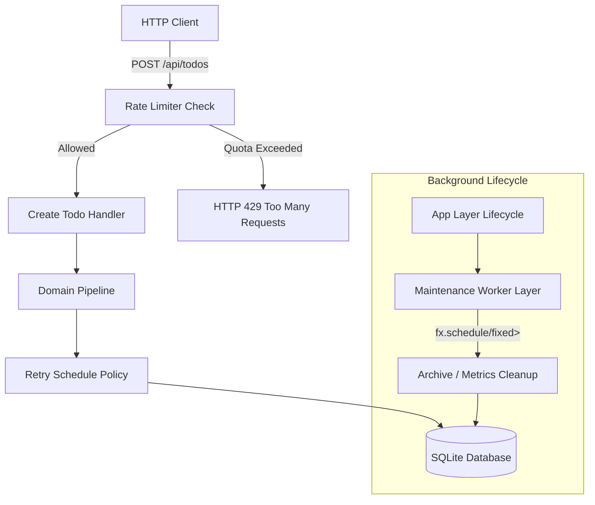

# Requirements

### Overview & Goals
The objective of this task is to integrate the newly created **`fx.schedule`** module into the `example` project (the Todo Application). This serves to demonstrate real-world, high-utility patterns including:
1. **Resilient Retry Policies**: Retrying transient database operations or external API calls using exponential backoff, jitter, and failure-tag filtering.
2. **Endpoint Rate Limiting & Circuit Breaking**: Protecting public API endpoints against traffic spikes and isolating external service dependencies.
3. **Background Scheduled Maintenance Tasks**: Running recurring background workers (such as periodic metrics rollups or automated todo archival) managed via composable `fx.layer` lifecycles.

### Scope

#### In Scope
- **Dependency Wiring**: Update `example/deps.edn` to include `fx/schedule {:local/root "../modules/fx-schedule"}`.
- **Resilience Layer & Middleware (`todo.resilience`)**:
  - Implement reusable retry policies (`db-retry-policy`) with exponential backoff and jitter.
  - Implement route-level rate limiting (`rate-limited-endpoint>`) for write-heavy endpoints (e.g. `POST /api/todos`).
  - Wire failure translation mappings for `:rate-limiter/exceeded` (HTTP 429 Too Many Requests) and `:circuit-breaker/open` (HTTP 503 Service Unavailable) in `todo.routes`.
- **Background Maintenance Worker (`todo.worker`)**:
  - Implement a managed recurring background maintenance worker using `fx.schedule/fixed>` and `fx.layer/make>`.
  - Periodically archive/cleanup completed todos and record maintenance execution metrics.
  - Wire the worker layer into `todo.main/app-layer>` for deterministic startup and teardown.
- **Integration Tests & Documentation**:
  - Add integration tests in `example/test/todo/` covering retries, rate limiting, and worker lifecycle.
  - Update `example/README.md` with resilience architecture patterns, diagrams, and runnable commands.
  - Add sample HTTP requests in `example/test.http` demonstrating rate limiting responses.

#### Out of Scope
- Introducing external distributed backends (e.g., Redis). All resilience coordination remains pure and in-memory.

### User Stories
- **US-1**: As an API developer, I want rate limiting on todo creation so that abuse and rapid request bursts are rejected with standard HTTP 429 responses.
- **US-2**: As a database engineer, I want automatic retries on transient DB errors with exponential backoff and jitter so that intermittent lock contention recovers without manual intervention.
- **US-3**: As a system operator, I want a background maintenance worker that periodically cleans up stale records with managed layer lifecycle so that system resources stay lean without manual cron jobs.

### Functional Requirements
- **FR-1**: `example/deps.edn` must include `fx/schedule` pointing to `../modules/fx-schedule`.
- **FR-2**: Transient database operations must wrap critical queries with `sched/retry-schedule>` using exponential backoff (`initial-ms: 50`, `factor: 2.0`, `max-ms: 1000`) and random jitter.
- **FR-3**: Route handlers wrapped with rate limiters must return status code `429 Too Many Requests` with structured JSON details when request limits are exceeded.
- **FR-4**: The background worker layer must start when the application system starts, execute maintenance tasks on a fixed schedule (e.g. every 60 seconds in production, configurable for tests), and cleanly terminate when the system is stopped.
- **FR-5**: All components must adhere strictly to repository guidelines: monomorphic parameter contracts, canonical naming conventions, and standard suffixes (`>`, `!`, `?`).

# Technical Design

### Current Implementation Context
- The `example` project currently consists of:
  - `todo.main`: System lifecycle management using `fx.layer` (`metrics-layer>`, `datasource-layer>`, `http-server-layer>`, `app-layer>`).
  - `todo.routes`: Reitit router with `fx.ring/wrap-fx` and failure map translating `:todo/not-found`, `:todo/invalid-input`, and `:fx.jdbc/error`.
  - `todo.domain`: Pure effect pipelines for CRUD operations.
  - `todo.db`: SQLite database interaction via `HoneySQL` and `fx.jdbc`.

### Key Decisions
1. **Dedicated Resilience Namespace (`todo.resilience`)**:
   - *Decision*: Consolidate schedule policies, rate limiter instances, and circuit breaker definitions into `todo.resilience`.
   - *Rationale*: Keeps domain and route definitions clean, separating resilience policies into composable, testable units.
2. **Managed Worker as an `fx.layer` (`worker-layer>`)**:
   - *Decision*: Model background workers as managed layers starting a cancellable recurrence loop on start and interrupting/closing on release.
   - *Rationale*: Guarantees zero background thread leakage on application shutdown or reload.
3. **HTTP Failure Translation for Resilience Channels**:
   - *Decision*: Map `:rate-limiter/exceeded` to HTTP 429 and `:circuit-breaker/open` to HTTP 503 in `todo.routes/failure-map`.
   - *Rationale*: Provides standard, client-friendly HTTP semantics for effect resilience failures.

### Architecture & Data Flow



### Proposed API Surface & Module Structure

#### `todo.resilience`
```clojure
(ns todo.resilience
  (:require [fx.core :as fx]
            [fx.schedule :as sched]))

(def db-retry-policy
  (-> (sched/exponential-backoff> {:initial-ms 50 :factor 2.0 :max-ms 1000})
      (sched/jitter> 0.1)
      (sched/intersect> (sched/recur-n> 3))
      (sched/while-tag> #{:fx.jdbc/error :jdbc/error :db/busy})))

(defn create-todo-rate-limiter []
  (sched/make-rate-limiter {:limit 10 :interval-ms 1000}))
```

#### `todo.worker`
```clojure
(ns todo.worker
  (:require [fx.core :as fx]
            [fx.layer :as fx-layer]
            [fx.observability.log :as log]
            [fx.schedule :as sched]
            [todo.db :as db]))

(defn maintenance-task> []
  (-> (log/log-info> "Running scheduled todo maintenance...")
      (fx/chain> (db/cleanup-old-completed-todos!> 30))
      (log/log-info> "Scheduled maintenance completed.")))

(defn worker-layer>
  ([] (worker-layer> 60000))
  ([interval-ms]
   (fx-layer/make> :todo/worker
     (-> (fx/context>)
         (fx/mapcat> (fn [ctx]
                       (start-worker-loop! ctx interval-ms))))
     (fn [worker-handle]
       (stop-worker-loop! worker-handle)))))
```

### File Structure Changes
- `example/deps.edn` (update dependencies)
- `example/src/todo/resilience.clj` (new resilience policies & rate limiters)
- `example/src/todo/worker.clj` (new background worker layer)
- `example/src/todo/routes.clj` (rate limiting middleware & failure translation)
- `example/src/todo/main.clj` (wire worker-layer into app-layer)
- `example/test/todo/resilience_test.clj` (new tests for retry policies & rate limiting)
- `example/test/todo/worker_test.clj` (new tests for worker execution & lifecycle)
- `example/README.md` (documentation updates)
- `example/test.http` (sample requests for rate limiting)

# Testing

### Validation Approach
Verification will be executed using Cognitect test runner across unit and integration tests covering the example application.

### Key Scenarios
- **Rate Limiting**: Repeated rapid requests to rate-limited routes return HTTP 429 after exceeding limit quota.
- **Database Retries**: Transient DB failures are retried according to backoff policy until successful or exhausted.
- **Worker Lifecycle**: Worker starts seamlessly with `app-layer>`, performs periodic executions, and terminates gracefully on system stop.
- **Full System CI**: Run `clojure -T:build test` and `clojure -T:build ci` to verify zero regressions across all modules.

### Test Changes
- Add `example/test/todo/resilience_test.clj`.
- Add `example/test/todo/worker_test.clj`.
- Update `example/test/todo/routes_test.clj` and `example/test/todo/api_test.clj`.

# Execution Plan

### ✓ Step 1: Wire fx/schedule dependency into example/deps.edn
- Add `fx/schedule {:local/root "../modules/fx-schedule"}` to `example/deps.edn`.

### ✓ Step 2: Implement resilience policies and retry wrapping in todo.resilience and todo.db
- Create `example/src/todo/resilience.clj` with `db-retry-policy`, `todo-rate-limiter`, and failure predicates.
- Add `cleanup-old-completed-todos!>` query helper in `todo.db`.
- Wrap critical DB operations in `todo.db` or `todo.domain` with `sched/retry-schedule>`.

### ✓ Step 3: Implement background maintenance worker in todo.worker and wire into todo.main
- Create `example/src/todo/worker.clj` using `fx.schedule/fixed>` and `fx.layer/make>` for recurring cleanup and maintenance.
- Wire `worker-layer>` into `todo.main/app-layer>` for deterministic startup and teardown.

### ✓ Step 4: Update todo.routes for rate limiting and failure translation
- Add route-level rate limiting middleware in `todo.routes`.
- Map `:rate-limiter/exceeded` to HTTP 429 and `:circuit-breaker/open` to HTTP 503 in `todo.routes/failure-map`.

### ✓ Step 5: Add tests for resilience, worker, and routes
- Add `example/test/todo/resilience_test.clj` and `example/test/todo/worker_test.clj`.
- Update `example/test/todo/routes_test.clj` and `example/test/todo/api_test.clj` to test retries, rate limiting, and worker lifecycle.

### ✓ Step 6: Update example documentation and HTTP requests
- Update `example/README.md` with resilience architecture patterns, diagrams, and runnable commands.
- Update `example/test.http` with sample rate limiting requests.