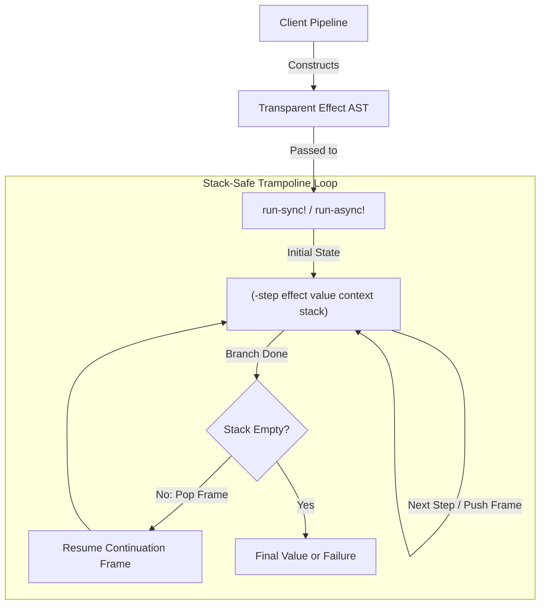

# Requirements

### Overview & Goals
The objective of this refactoring is to modernize the FX runtime engine in `com.lambdaseq.fx.core` by transitioning from opaque closure-based execution and dynamic var bindings to a **100% transparent, data-driven AST** with a **uniform, stack-safe interpreter loop**.

### Scope
- **In Scope:**
  - Replace opaque `(fn [v] ...)` closures in `Effect` with transparent data maps (`:tag`, `:prev-effect`, `:data`).
  - Eliminate dynamic coercion helpers (`eval-eff-or-fn`) and enforce deterministic monomorphic parameter contracts across all combinators.
  - Eliminate dynamic var overhead (`*context*`) by explicitly threading context maps through the interpreter and step transitions.
  - Implement a stack-safe interpreter loop using explicit heap-allocated continuation frames (`stack`) to prevent JVM `StackOverflowError`.
  - Optimize forward execution order to eliminate `O(N)` reverse sequence traversals per run.
  - Ensure all effect types are evaluated uniformly via a standardized protocol interface rather than ad-hoc switch statements or scattered sub-runners.
  - Update tests and `fx-typed` annotations.
- **Out of Scope:**
  - Introducing external dependencies (the runtime remains zero-dependency Clojure/ClojureScript).
  - Modifying external user-facing semantics of success/failure channels.

### User Stories
- **As a library consumer**, I want to inspect and transform existing effect pipelines as pure data so that I can dynamically rewrite configurations, mock services in tests, and inject telemetry.
- **As a developer**, I want deterministic function signatures so that type mismatches fail fast without subtle runtime reflection or arity errors.
- **As a high-throughput backend engineer**, I want stack safety and zero dynamic var overhead so that nested pipelines and async thread transitions are fast, predictable, and cannot blow the JVM stack.

### Functional Requirements
1. **Transparent AST Representation:** Every effect must expose its `:tag`, `:prev-effect`, and transparent `:data` map (containing configuration, functions, or sub-effects).
2. **Monomorphic Combinators:** Combinators expecting effects must only accept `Effect` instances; combinators expecting pure functions must only accept functions.
3. **Pure Context Passing:** `run-sync!` and `run-async!` accept an explicit `context` map (defaulting to `{}`) that is threaded as a pure parameter.
4. **Uniform Execution:** Every effect type participates in the interpreter via a uniform protocol step method `(-step [this value context stack])`.
5. **Stack Safety:** Executing deeply nested chains or recursive sub-effects must run in $O(1)$ JVM stack space.

### Non-Functional Requirements
- **Performance:** Reduced GC allocations and zero dynamic var binding cost on pipeline execution.
- **Cross-Platform Compatibility:** Full support for both Clojure (JVM) and ClojureScript.
- **Strict Naming Directives:** Adhere to canonical `>` naming for combinators, `!` for runners, and `?` for predicates with no redundant aliases.

# Technical Design

### Current Implementation
In `com.lambdaseq.fx.core`:
- `(defrecord Effect [tag prev-effect run])` stores an opaque Clojure function `run` that closes over parameters.
- Context is held in dynamic var `^:dynamic *context*`.
- Branching and nested combinators (`try>`, `provide>`, `ensure>`, `if>`, `cond>`, `catch>`) call `(-run! ...)` recursively, growing the JVM call stack.
- `eval-eff-or-fn` performs runtime type introspection and catches `ArityException` dynamically.
- `run-sync!` unrolls the `:prev-effect` chain to a sequence and reverses it on every invocation.

---

### Key Decisions

1. **Uniform Data Model (`Effect` Record with `:data` Map):**
   - *Decision:* Represent effects as `(defrecord Effect [tag prev-effect data])` implementing `ITagged`, `IEffect`, and standard Clojure map interfaces.
   - *Rationale:* Provides 100% data transparency for traversal and transformation utilities while retaining fast record field access and uniform protocol dispatch.

2. **Uniform Step Protocol (`-step`):**
   - *Decision:* Define `(-step [this value context stack])` on `IEffect` returning `[next-effect next-value next-context next-stack]`.
   - *Rationale:* Replaces monolithic `case` statements with a uniform contract where every effect handles its own step transition identically.

3. **Explicit Context Threading:**
   - *Decision:* Pass `context` explicitly through `run-sync!`, `run-async!`, and `-step` instead of `*context*` dynamic binding.
   - *Rationale:* Eliminates dynamic var lookup overhead and makes async execution across `CompletableFuture` and JS `Promise` thread-safe and allocation-free.

4. **Explicit Continuation Stack for Stack Safety:**
   - *Decision:* Use a persistent list `stack` of continuation frames (e.g., `:restore-context`, `:ensure`, `:branch-continuation`) inside a single `loop/recur` interpreter.
   - *Rationale:* Converts nested recursion into constant JVM stack space, completely preventing `StackOverflowError`.

5. **Strict Monomorphic Signatures:**
   - *Decision:* Remove `eval-eff-or-fn` and enforce strict types for each combinator parameter.
   - *Rationale:* Eliminates runtime reflection, removes silent arity bugs, and simplifies debugging and static typing in `fx-typed`.

---

### Proposed Changes

#### 1. Protocols & Core Records
```clojure
(defprotocol ITagged
  (tag [this] "Returns the tag keyword identifying the structure."))

(defprotocol IFailure
  (error-data [this] "Returns the error data payload."))

(defprotocol IEffect
  (prev-effect [this] "Returns upstream effect or nil.")
  (-step [this value context stack]
    "Performs one execution step, returning:
     [next-effect next-value next-context next-stack]"))

(defrecord Effect [tag prev-effect data]
  ITagged
  (tag [_] tag)
  IEffect
  (prev-effect [_] prev-effect)
  (-step [this value context stack]
    ;; Dispatches step evaluation based on uniform record/protocol behavior
    ))
```

#### 2. Stack-Safe Interpreter Loop (`run-sync!`)
```clojure
(defn run-sync!
  ([effect] (run-sync! effect {}))
  ([root-effect initial-context]
   (loop [curr-eff  root-effect
          curr-val  nil
          curr-ctx  initial-context
          stack     ()]
     (cond
       ;; Branch finished: handle continuation frames from stack
       (nil? curr-eff)
       (if (empty? stack)
         curr-val
         (let [[frame & rest-stack] stack]
           (case (:type frame)
             :restore-context
             (recur nil curr-val (:context frame) rest-stack)

             :ensure
             (let [{:keys [original-value]} frame]
               (if (failure? curr-val)
                 (recur nil curr-val curr-ctx rest-stack)
                 (recur nil original-value curr-ctx rest-stack)))

             :map-continuation
             (let [f (:f frame)]
               (if (failure? curr-val)
                 (recur nil curr-val curr-ctx rest-stack)
                 (recur nil (f curr-val) curr-ctx rest-stack))))))

       ;; Step next effect
       :else
       (let [[next-eff next-val next-ctx next-stack]
             (-step curr-eff curr-val curr-ctx stack)]
         (recur next-eff next-val next-ctx next-stack))))))
```

#### 3. Combinator Signatures & Data Representation
- `(succeed> value)` $\to$ `Effect. :succeed nil {:value value}`
- `(fail> tag data)` $\to$ `Effect. :fail nil {:failure (Failure. tag data)}`
- `(map> prev f)` $\to$ `Effect. :map prev {:f f}`
- `(map-ctx> prev f)` $\to$ `Effect. :map-ctx prev {:f f}`
- `(provide> prev body ctx-map)` $\to$ `Effect. :provide prev {:body body :context-map ctx-map}`
- `(ensure> prev finalizer-eff)` $\to$ `Effect. :ensure prev {:finalizer finalizer-eff}`
- `(if> prev cond-eff then-eff else-eff)` $\to$ `Effect. :if prev {:cond cond-eff :then then-eff :else else-eff}`
- `(all> effects)` $\to$ `Effect. :all nil {:effects effects}`
- `(zip-with> eff-a eff-b f)` $\to$ `Effect. :zip-with nil {:eff-a eff-a :eff-b eff-b :f f}`

---

### Architecture Diagram



---

### File Structure Changes
- `modules/fx-core/src/com/lambdaseq/fx/core.cljc`:
  - Replace `Effect` record and `IEffect` protocol with new `-step` contract.
  - Implement uniform combinator constructors writing to `:data`.
  - Rewrite `run-sync!` and `run-async!` with context-threading and stack-safe continuation loop.
  - Remove `*context*` dynamic binding and `eval-eff-or-fn`.
- `modules/fx-core/test/com/lambdaseq/fx/core_test.cljc`:
  - Update and expand test suites for AST inspection, monomorphic types, context threading, and deep stack safety.
- `modules/fx-typed/src/com/lambdaseq/fx/typed.cljc`:
  - Update Typed Clojure protocol annotations and signatures.

---

### Risks & Mitigations
- **Breaking changes to non-monomorphic call sites:** Existing code passing callback lambdas to combinators expecting effects (e.g. `or-else>`) will fail.
  - *Mitigation:* Clear compiler and runtime error messages, updated documentation, and matching test updates.
- **ClojureScript Compatibility:** Async promises in JS need explicit context propagation.
  - *Mitigation:* Because context is a plain immutable map passed as an argument, it passes cleanly into JS Promise closures.

# Testing

### Validation Approach
Verification will be automated through Clojure/ClojureScript unit tests, property checks, and stack-safety stress tests.

### Key Scenarios
1. **AST Transparency & Inspection:**
   - Verify all effect records expose `:tag`, `:prev-effect`, and readable `:data` fields.
   - Verify AST traversal functions can inspect and transform pipeline stages without executing them.
2. **Deterministic Monomorphic Types:**
   - Verify combinators accept only their specified argument types (effects vs pure functions).
   - Verify invalid argument types produce clear assertion/contract errors.
3. **Pure Context Propagation:**
   - Verify `run-sync!` with initial context correctly passes context to `context>`, `service>`, `map-ctx>`, and `do-ctx>`.
   - Verify `provide>` locally overrides context for inner effects and restores parent context after child completion.
   - Verify nested `provide>` calls isolate context cleanly without dynamic vars.
4. **Stack Safety under Deep Recursion:**
   - Execute a 100,000-step linear pipeline (e.g., chained `map>`) and verify execution succeeds in constant JVM stack space.
   - Execute a deeply nested recursive `mapcat>` / `if>` pipeline (10,000 levels deep) and verify no `StackOverflowError` occurs.
5. **Async Runner Execution:**
   - Verify `run-async!` correctly propagates context and evaluates effects on background thread pools (JVM) and promises (JS).

### Edge Cases
- Upstream failure propagation across all combinators without invoking unnecessary downstream steps.
- Failure during `ensure>` finalizer properly overriding upstream success while preserving failure diagnostics.
- Empty collection handling in `all>`, `for-each>`, and `cond>`.
- Exceptions thrown within pure transformation functions captured into structured `Failure` records where expected.

# Delivery Steps

### ✓ Step 1: Refactor Core Protocols and Transparent Effect Data Structure
Core effect protocols and data structures are updated to be transparent, uniform, and stack-safe.

- Redefine `IEffect` protocol with a uniform `-step [this value context stack]` interface returning `[next-effect next-value next-context next-stack]`.
- Define uniform `Effect` data record `(defrecord Effect [tag prev-effect data])` implementing `ITagged`, `IEffect`, and `IPersistentMap`.
- Ensure all effect data fields (e.g., `:f`, `:key`, `:default`, `:policy`, `:handlers`, `:target`) are stored as first-class transparent keys in `:data`.
- Eliminate `eval-eff-or-fn` helper, `maybe-propagate-effect`, and dynamic `ArityException` catches across the entire namespace.
- Update `ITagged` and `IFailure` protocols and record implementations for consistency.

### ✓ Step 2: Implement Monomorphic Effect Constructors and Combinators
All effect constructors and combinators strictly adhere to monomorphic contracts and uniform step evaluation.

- Refactor pure function combinators (`map>`, `map-ctx>`, `tap>`, `tap-error>`, `do-ctx>`) to accept strict functions and construct uniform `Effect` descriptors.
- Refactor structural and branching combinators (`if>`, `cond>`, `match>`, `or-else>`, `or-else-fail>`, `all>`, `zip>`, `zip-with>`, `for-each>`, `mapcat>`) to enforce strict `Effect` arguments or explicit effect-producing functions.
- Refactor contextual and resource combinators (`context>`, `service>`, `provide>`, `provide-service>`, `ensure>`, `acquire-release>`, `retry>`, `try>`, `catch>`, `catchall>`, `die>`, `or-die>`, `sleep>`) to store parameters in `:data` and implement uniform step transitions.
- Enforce canonical naming conventions with `>` suffixes and eliminate any implicit callback coercion.

### ✓ Step 3: Build Stack-Safe Interpreter and Pure Context Runtime
Synchronous and asynchronous runners evaluate pipelines using a constant JVM stack without dynamic var overhead.

- Implement stack-safe interpreter loop in `run-sync!` that iteratively executes `-step` transitions and pops continuation stack frames.
- Support core continuation frame types (`:restore-context`, `:ensure-cleanup`, `:seq-continuation`, `:branch-continuation`) in the interpreter loop.
- Pass `context` as an explicit parameter through `run-sync!` and `-step`, removing dependence on `*context*` dynamic binding.
- Implement `run-async!` with zero dynamic var re-binding overhead using explicit context propagation to `CompletableFuture` / `Promise`.
- Optimize forward pipeline execution to eliminate reverse sequence traversals on every run.

### ✓ Step 4: Update Test Suite and Type Annotations
Unit tests, property checks, stack safety benchmarks, and type annotations are updated and verified.

- Update `core_test.cljc` to validate monomorphic contracts, catching invalid type arguments at construction/execution time.
- Add deep-recursion and high-iteration stress tests to verify constant JVM stack depth under deeply nested pipelines.
- Add test coverage for context propagation and nested `provide>` context isolation without dynamic vars.
- Update `fx-typed` annotations in `com.lambdaseq.fx.typed` and verify typed test suite compatibility.