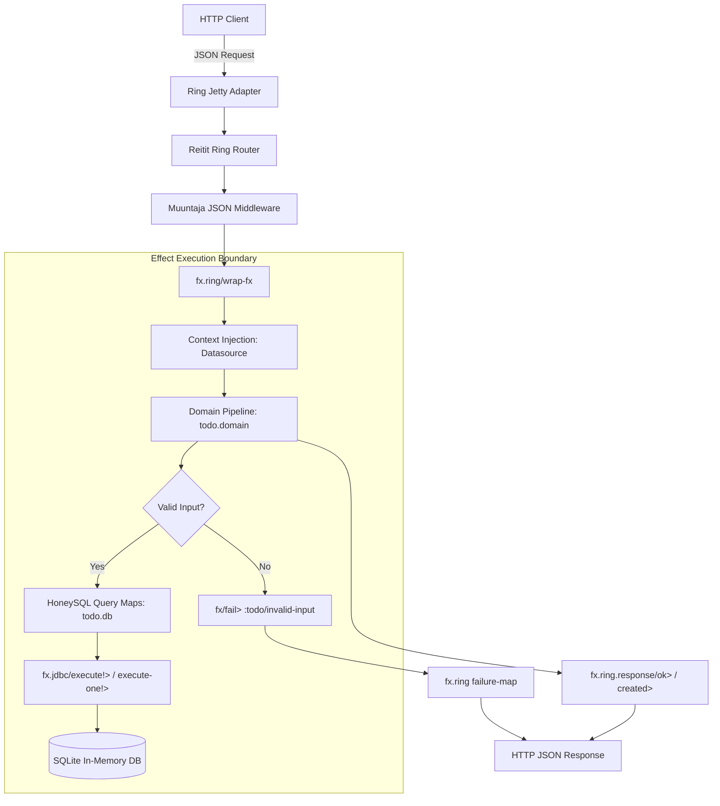

# Requirements

### Overview & Goals
The goal of this task is to create a complete, idiomatic Todo example application in a top-level `example` directory. The example will demonstrate how to build full-stack functional web services using the `fx` effect system libraries (`fx.core`, `fx.jdbc`, `fx.ring`) alongside standard Clojure ecosystem libraries: **HoneySQL v2** for SQL generation, **Reitit** for routing, **Muuntaja** for JSON negotiation, and **SQLite (in-memory)** for zero-configuration persistence.

### Scope
#### In Scope
- Standalone example project under `example/` with its own `deps.edn` referencing local fx modules (`fx-core`, `fx-jdbc`, `fx-ring`).
- In-memory SQLite database setup with automatic schema initialization on startup.
- HoneySQL v2 data-driven query definitions for all Todo CRUD operations.
- Pure effect pipelines in `fx.core` for business logic, validation, and error propagation via typed failure channels (`IFailure`).
- Declarative HTTP routing with `metosin/reitit-ring` and endpoint wrapping using `fx.ring/wrap-fx` with ambient context dependency injection (`::fx-jdbc/datasource`).
- HTTP response construction with `fx.ring.response` (`ok>`, `created>`, `not-found>`, `bad-request>`) and automated `failure-map` error translation.
- Embedded Jetty server lifecycle (`start-server!`, `stop-server!`, `-main`).
- Comprehensive automated test suite (`clojure.test`) covering end-to-end HTTP flows and failure scenarios.
- Documentation (`example/README.md`) with architecture explanations, REPL workflows, and curl commands.
- Root `deps.edn` alias `:example` for running tests and the server from the repository root.

#### Out of Scope
- Frontend UI components (focus is purely on the backend HTTP API).
- Authentication and multi-tenant authorization (kept simple and focused on effect composition).
- External database server dependencies (PostgreSQL/MySQL).

### User Stories
- **As a developer learning `fx`**, I want to see a full, working Clojure REST API example so that I understand how `fx.core`, `fx.jdbc`, and `fx.ring` fit together in a real-world web application.
- **As an API client**, I want to create, read, update, toggle, and delete todos via JSON REST endpoints, receiving standard HTTP status codes and structured error responses.
- **As a maintainer**, I want automated integration tests that run quickly against an in-memory database without external dependencies.

### Functional Requirements
- **Create Todo**: `POST /api/todos` accepting `{:title "...", :description "..."}`. Returns `201 Created` with the persisted todo map. Returns `400 Bad Request` if `title` is missing or blank.
- **List Todos**: `GET /api/todos` with optional query param `?completed=true|false`. Returns `200 OK` with a JSON list of todos.
- **Get Todo**: `GET /api/todos/:id`. Returns `200 OK` with the matching todo or `404 Not Found` if missing.
- **Update Todo**: `PUT /api/todos/:id` accepting `{:title "...", :description "...", :completed bool}`. Returns `200 OK` with the updated todo or `404 Not Found`.
- **Toggle Todo Status**: `PATCH /api/todos/:id/toggle`. Flips `:completed` status and returns `200 OK` or `404 Not Found`.
- **Delete Todo**: `DELETE /api/todos/:id`. Removes the todo and returns `200 OK` `{:deleted true, :id id}` or `404 Not Found`.

### Non-Functional Requirements
- **Zero Configuration**: Runs with standard `clojure` CLI tools without requiring external database servers or Docker.
- **Pure Effect Semantics**: Follows strict `fx` repository directives (canonical naming with `>`, runners with `!`, monomorphic parameter contracts).
- **Stack & Resource Safety**: Ensures database connections are acquired and released safely through `fx.jdbc` primitives.

# Technical Design

### Current Implementation
The `fx` repository provides:
- `fx.core`: Core effect runtime, heap continuation stack, combinators (`succeed>`, `fail>`, `map>`, `mapcat>`, `catch>`, `match>`, `service>`, `provide>`), and synchronous/asynchronous runners (`run-sync!`, `run-async!`).
- `fx.jdbc`: Connection management (`get-datasource>`, `get-connection>`, `with-connection>`), transaction boundaries (`with-transaction>`), and statement executors (`execute!>`, `execute-one!>`, `plan!>`).
- `fx.ring`: Ring integration converting effect pipelines into Ring handlers (`wrap-fx`), ambient context injection (`build-fx-context`), and response builders in `fx.ring.response` (`ok>`, `created>`, `not-found>`, `bad-request>`, `status>`, `header>`).

### Key Decisions
1. **Declarative `wrap-fx` with Ambient Context DI**: Route handlers will define pure effect pipelines wrapped via `fx.ring/wrap-fx`. Ambient dependencies (e.g. `::fx-jdbc/datasource`) are passed via `wrap-fx` provider options, keeping handlers pure, inspectable, and easily mockable.
2. **HoneySQL v2 for SQL Generation**: Queries are defined as pure Clojure data structures and formatted to parameterized SQL `[sql & params]` with `honey.sql/format`, which are then evaluated with `fx.jdbc/execute!>` / `fx.jdbc/execute-one!>`.
3. **In-Memory SQLite**: Uses `org.xerial/sqlite-jdbc` with in-memory JDBC URL (`jdbc:sqlite::memory:` or shared cache) for fast, zero-dependency testing and evaluation.
4. **Content Negotiation with Muuntaja**: Uses `metosin/muuntaja` middleware inside Reitit Ring router to handle JSON body parsing and serialization transparently.

### Architecture Diagram


### Components & Namespace Architecture
1. **`todo.db` (`example/src/todo/db.clj`)**:
   - `datasource-spec`: In-memory SQLite connection map.
   - `init-db!>`: Effect executing DDL statement for `todos` table.
   - `sql-*`: HoneySQL data structure definitions for queries (`sql-insert-todo`, `sql-select-all`, `sql-select-by-id`, `sql-update-todo`, `sql-toggle-todo`, `sql-delete-todo`).
   - Query runners: Wrapped `fx.jdbc/execute!>` and `execute-one!>` calls taking HoneySQL maps.

2. **`todo.domain` (`example/src/todo/domain.clj`)**:
   - Pure domain effect pipelines using `fx.core` combinators.
   - Input validation (checking required strings, boolean flags).
   - Domain operations: `list-todos>`, `get-todo-by-id>`, `create-todo>`, `update-todo>`, `toggle-todo>`, `delete-todo>`.
   - Returns entities on success or typed `fx/fail>` records (`:todo/not-found`, `:todo/invalid-input`).

3. **`todo.routes` (`example/src/todo/routes.clj`)**:
   - Reitit Ring router definition with `/api/todos` endpoints.
   - Handlers wrapped with `fx.ring/wrap-fx` providing `::fx-jdbc/datasource` from the active app state.
   - Failure map translation:
     - `:todo/not-found` -> `{:status 404, :body {:error "Not Found", :details err}}`
     - `:todo/invalid-input` -> `{:status 400, :body {:error "Bad Request", :details err}}`
     - `:jdbc/error` -> `{:status 500, :body {:error "Database Error"}}`

4. **`todo.main` (`example/src/todo/main.clj`)**:
   - Application lifecycle management (`start-server!`, `stop-server!`, `-main`).
   - Initializes datasource, runs `init-db!>`, builds Reitit router, and boots Jetty on port 3000 (configurable via `PORT` env var).

### File Structure
```
fx/
├── deps.edn                     # Updated with :example alias
└── example/
    ├── deps.edn                 # Example project dependencies
    ├── README.md                # Example documentation & curl guide
    ├── src/
    │   └── todo/
    │       ├── db.clj           # HoneySQL queries & fx.jdbc access
    │       ├── domain.clj       # Domain logic & effect pipelines
    │       ├── routes.clj       # Reitit router & fx.ring handler wrappers
    │       └── main.clj         # Jetty runner & bootstrap entrypoint
    └── test/
        └── todo/
            └── api_test.clj     # clojure.test HTTP integration tests
```

### Risks & Mitigations
- **SQLite In-Memory Scope**: By default, in-memory SQLite instances (`jdbc:sqlite::memory:`) are per-connection unless configured with a named shared cache (`jdbc:sqlite:file:tododb?mode=memory&cache=shared`).
  - *Mitigation*: Configure the SQLite datasource with a named shared-cache in-memory URI so multiple connection pool threads access the same in-memory tables.
- **JSON Serialization of Timestamps/Keywords**:
  - *Mitigation*: Store timestamps as ISO-8601 strings or epoch integers, and configure Muuntaja with default keyword keys for JSON maps.

# Testing

### Validation Approach
The Todo example project will be verified using automated `clojure.test` suites that test the full application stack (Reitit router + Muuntaja + `fx.ring` + `fx.core` + `fx.jdbc` + HoneySQL + SQLite in-memory).

### Key Scenarios
1. **CRUD Happy Path**:
   - Create a new todo (`POST /api/todos` with `{:title "Buy groceries", :description "Milk and eggs"}`). Verify `201 Created` with generated ID and timestamps.
   - Fetch the created todo by ID (`GET /api/todos/:id`). Verify `200 OK` and matching attributes.
   - List todos (`GET /api/todos`). Verify the created todo appears in the list.
   - Update todo details (`PUT /api/todos/:id` with `{:title "Buy organic groceries", :completed false}`). Verify `200 OK` with updated title.
   - Toggle completed status (`PATCH /api/todos/:id/toggle`). Verify `200 OK` and `:completed true`.
   - Filter todos by status (`GET /api/todos?completed=true`). Verify list contains completed todos.
   - Delete todo (`DELETE /api/todos/:id`). Verify `200 OK` deletion acknowledgement.
   - Verify deleted todo no longer appears in `GET /api/todos/:id` (returns `404`).

2. **Failure Handling & Status Codes**:
   - `POST /api/todos` with missing or blank `:title`: Verify `400 Bad Request` with structured error message.
   - `GET /api/todos/999999` for non-existent ID: Verify `404 Not Found`.
   - `PUT /api/todos/999999` for non-existent ID: Verify `404 Not Found`.
   - `DELETE /api/todos/999999` for non-existent ID: Verify `404 Not Found`.

3. **Pure Effect Unit Testing**:
   - Test domain pipelines directly with `fx/run-sync!` by injecting mock or in-memory datasources into the context map.

### Test Execution Commands
- In `example/` directory:
  ```bash
  clojure -M:test
  ```
- From repository root:
  ```bash
  clojure -M:example -e "(require 'clojure.test 'todo.api-test) (clojure.test/run-tests 'todo.api-test)"
  ```

# Delivery Steps

### ✓ Step 1: Setup dependencies, SQLite datasource, and HoneySQL query layer
Initialize the example project structure, dependencies, and SQLite database interaction layer using HoneySQL and `fx.jdbc`.

- Create `example/deps.edn` defining dependencies for `io.github.conjurernix/fx.core`, `fx.jdbc`, `fx.ring`, `com.github.seancorfield/honeysql`, `metosin/reitit-ring`, `metosin/muuntaja`, `ring/ring-jetty-adapter`, and `org.xerial/sqlite-jdbc`.
- Update root `deps.edn` to include an `:example` alias pointing to `example/src` and `example/test`.
- Create `example/src/todo/db.clj` with functions for:
  - Constructing SQLite in-memory `javax.sql.DataSource` via `fx.jdbc/get-datasource>`.
  - Initializing schema (`CREATE TABLE IF NOT EXISTS todos (...)`) with `fx.jdbc/execute!>`.
  - Generating parameterized SQL statements with `honey.sql/format` for CRUD queries (SELECT, INSERT, UPDATE, DELETE, TOGGLE).
  - Query execution combinators returning unqualified kebab-case maps via `fx.jdbc/as-unqualified-kebab-maps`.

### ✓ Step 2: Implement domain logic and effect pipelines
Implement the business logic and effect pipelines for Todo domain operations using `fx.core` combinators and failure channels.

- Create `example/src/todo/domain.clj` providing pure effect pipelines:
  - `list-todos>`: queries all todos with optional `:completed` boolean filter.
  - `get-todo-by-id>`: retrieves a single todo by ID, failing with `:todo/not-found` if missing.
  - `create-todo>`: validates input payload (non-blank title required), inserts new todo with timestamps, and returns the created entity.
  - `update-todo>`: validates payload, verifies existence, updates fields, and returns updated entity.
  - `toggle-todo>`: flips the `:completed` boolean flag for a given todo ID.
  - `delete-todo>`: deletes a todo by ID or returns `:todo/not-found` failure.
- Ensure all pipelines use ambient context dependency injection for `::fx-jdbc/datasource` via `fx/service>`.

### ✓ Step 3: Build Reitit HTTP routes, middleware, and failure mapping
Build the Reitit HTTP router, Muuntaja JSON middleware, and Ring failure mapping using `fx.ring` and `fx.ring.response`.

- Create `example/src/todo/routes.clj` declaring Reitit routes:
  - `GET /api/todos` -> `list-todos>` mapped to `fx-resp/ok>`
  - `POST /api/todos` -> `create-todo>` mapped to `fx-resp/created>`
  - `GET /api/todos/:id` -> `get-todo-by-id>` mapped to `fx-resp/ok>`
  - `PUT /api/todos/:id` -> `update-todo>` mapped to `fx-resp/ok>`
  - `PATCH /api/todos/:id/toggle` -> `toggle-todo>` mapped to `fx-resp/ok>`
  - `DELETE /api/todos/:id` -> `delete-todo>` mapped to `fx-resp/ok>`
- Wrap handlers using `fx.ring/wrap-fx` with ambient context provider supplying `::fx-jdbc/datasource`.
- Configure `failure-map` to translate `:todo/not-found` to 404, `:todo/invalid-input` to 400, and `:jdbc/error` to 500 status responses.
- Configure Muuntaja format negotiation middleware for seamless JSON request decoding and response serialization.

### ✓ Step 4: Add server lifecycle, integration test suite, and documentation
Implement server lifecycle entrypoint and an automated test suite verifying all endpoints, queries, and error handling.

- Create `example/src/todo/main.clj` implementing:
  - `start-server!` and `stop-server!` using `ring.adapter.jetty/run-jetty`.
  - Schema initialization during server bootstrap.
  - Standard `-main` entrypoint for CLI execution.
- Create `example/test/todo/api_test.clj` using `clojure.test`:
  - Test happy-path CRUD operations via simulated HTTP Ring requests.
  - Test error cases (400 on empty title, 404 on missing todo id, invalid JSON).
  - Verify transactional consistency and state isolation across tests.
- Create `example/README.md` documenting architecture, REPL workflows, running the server, running tests, and curl API examples.