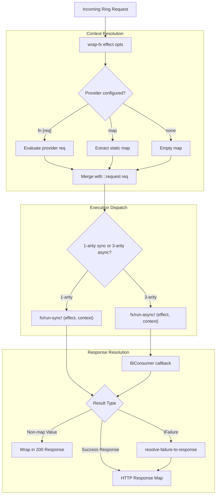

# Requirements

### Overview & Goals
The objective of this design is to transition `com.lambdaseq.fx.ring/wrap-fx` from wrapping callable handler functions `(fn [req] effect)` to directly wrapping pure `IEffect` pipelines. In addition, external dependencies (such as database pools, HTTP clients, and configuration maps) will be supplied via dedicated context providers injected into the runtime execution context rather than attached as mutable properties on the Ring request map.

This maximizes system utility and developer ergonomics by:
- Eliminating unnecessary anonymous function wrappers at the handler definition site.
- Decoupling request metadata from dependency injection mechanisms.
- Ensuring deterministic, monomorphic parameter contracts across all effect boundaries.
- Providing zero-overhead context propagation directly to `fx/run-sync!` and `fx/run-async!`.

### Scope
- **In Scope:**
  - Update `wrap-fx` in `modules/fx-ring/src/com/lambdaseq/fx/ring.clj` to accept an `IEffect` pipeline directly and return a compliant 1-arity synchronous and 3-arity asynchronous Ring handler.
  - Implement unified context and service provider resolution supporting static dependency maps and dynamic `(fn [req] ...)` provider functions.
  - Eliminate request map pollution (removing `::context` mutation from `req`).
  - Correct `CompletableFuture.whenComplete` interop for asynchronous 3-arity Ring handlers.
  - Update unit and integration tests in `modules/fx-ring/test/com/lambdaseq/fx/ring_test.clj` to validate the new effect-driven architecture.
- **Out of Scope:**
  - Modifying the core evaluation engine in `com.lambdaseq.fx.core`.
  - HTTP routing logic (which remains delegated to standard Ring routing engines such as Reitit or Compojure).

### User Stories
- **As an API developer**, I want to define web endpoints as top-level, pure `Effect` pipelines and wrap them with `(fx-ring/wrap-fx effect)` so that my codebase remains concise, declarative, and free of redundant `(fn [req] ...)` boilerplate.
- **As a system architect**, I want external services (datasources, loggers, microservice clients) injected directly into the `fx` execution context via a configured provider so that effects access dependencies cleanly via `(fx/service> :db)` without polluting HTTP request maps.
- **As a platform maintainer**, I want asynchronous Ring endpoints to evaluate non-blockingly via `fx/run-async!` with robust exception handling and zero reflection overhead.

### Functional Requirements
1. **Monomorphic Effect Input for `wrap-fx`:**
   - `(fx-ring/wrap-fx effect)` and `(fx-ring/wrap-fx effect opts)` must strictly accept an `IEffect` instance.
   - Returns a Ring handler supporting both 1-arity `(fn [req])` synchronous evaluation and 3-arity `(fn [req respond raise])` asynchronous evaluation.
2. **Unified Context & Service Provider:**
   - `opts` may supply `:provider`, `:context`, or `:services` as either:
     - A static map of dependencies (e.g., `{:datasource ds, :http-client client}`).
     - A dynamic unary function `(fn [req] context-map)` evaluated per request.
   - The resolved context is merged with `{fx-resp/request-key req}` and passed directly to the effect runner (`fx/run-sync!` or `fx/run-async!`).
   - The incoming Ring `req` map is never mutated or augmented with internal context keys.
3. **Pipeline Request & Service Access:**
   - Effects access the active request via `(fx-resp/request>)` or `(fx-resp/request> key)` and access services via `(fx/service> key)`.
4. **Integrated Failure Resolution:**
   - Any `IFailure` returned from the effect pipeline is automatically intercepted and translated into a well-formed Ring response using the hybrid resolution strategy (`:failure-map`, `:status` key in `error-data`, or default 500 fallback).
5. **Robust Async Interop:**
   - Asynchronous 3-arity handler evaluation must use `java.util.function.BiConsumer` with `CompletableFuture.whenComplete` to prevent Java interop reflection errors.

### Non-Functional Requirements
- **Strict Canonical Naming & Suffix Directives:** No alias exports; strict adherence to `>` for effect combinators and `!` for execution runners.
- **Monomorphic Parameter Contracts:** No dual-mode polymorphic callback vs. effect dispatch.
- **Zero Request Mutation:** Pure context scoping preserving immutability and test isolation.
- **High Concurrency & Stack Safety:** Non-blocking async execution without thread pool starvation.

# Technical Design

### Current Implementation
Currently, `com.lambdaseq.fx.ring` defines:
- `wrap-fx-context`: Injects request and service maps into the request map under `(assoc req ::context ...)`.
- `wrap-fx-runner`: Accepts a handler function `(fn [req] ...)` that returns an effect, extracting context from `(::context req)`.
- `wrap-fx`: Composes `wrap-fx-runner`, `wrap-fx-failures`, and `wrap-fx-context` around a callable handler function.
- `CompletableFuture.whenComplete` in `wrap-fx-runner` passes a standard Clojure function directly, which fails at runtime due to missing `BiConsumer` interface implementation.

### Key Decisions
1. **Monomorphic Effect-Driven `wrap-fx`:**
   - *Decision:* `wrap-fx` accepts an `IEffect` pipeline directly (e.g. `(wrap-fx effect-pipeline opts)`) rather than a function returning an effect.
   - *Rationale:* Maximizes developer velocity and syntactic purity, aligning HTTP endpoint declarations with standard Clojure effect pipelines.
2. **Zero-Pollution Context Injection:**
   - *Decision:* Pass the resolved context directly into `(fx/run-sync! effect context)` and `(fx/run-async! effect context)` without modifying the incoming Ring `req` map.
   - *Rationale:* Prevents context contamination across middleware chains and ensures strict immutability of Ring request data.
3. **Unified Provider Interface:**
   - *Decision:* Support `:provider`, `:context`, or `:services` as a map or `(fn [req] ...)` in `wrap-fx` options.
   - *Rationale:* Accommodates both static infrastructure dependencies (connection pools, configuration) and dynamic per-request contextual dependencies (authenticated session, tenant IDs) with optimal utility.
4. **Native `BiConsumer` Interop for Async Execution:**
   - *Decision:* Reify `java.util.function.BiConsumer` when completing `CompletableFuture` from `fx/run-async!`.
   - *Rationale:* Eliminates Java interop reflection failures and guarantees non-blocking execution in 3-arity Ring servers.

### Architecture & Data Flow



### Data Models / Contracts

#### Function Signatures (`com.lambdaseq.fx.ring`)
```clojure
(def request-key :com.lambdaseq.fx.ring/request)

(defn build-fx-context
  "Constructs the execution context map for an effect run.
   Merges resolved provider/services with {request-key req}."
  [req opts]
  (let [provider (or (:provider opts) (:context opts) (:services opts))
        provided-ctx (cond
                       (fn? provider)  (provider req)
                       (map? provider) provider
                       :else           {})]
    (merge provided-ctx {request-key req})))

(defn wrap-fx
  "Converts a pure IEffect pipeline into a standard Ring HTTP handler.
   Supports 1-arity synchronous (fn [req]) and 3-arity asynchronous (fn [req respond raise]).
   
   Options:
     :provider        - Map or (fn [req]) providing external dependencies / services
     :context         - Alias for :provider
     :services        - Alias for :provider
     :failure-map     - Map of failure tags to handler functions (fn [error-data req])
     :default-handler - Fallback failure handler function (fn [failure req])"
  ([effect]
   (wrap-fx effect nil))
  ([effect opts]
   (fn
     ([req]
      (let [ctx (build-fx-context req opts)
            res (fx/run-sync! effect ctx)]
        (resolve-failure-to-response res req opts)))
     ([req respond raise]
      (try
        (let [ctx (build-fx-context req opts)
              ^CompletableFuture cf (fx/run-async! effect ctx)]
          (.whenComplete cf
            (reify java.util.function.BiConsumer
              (accept [_ val err]
                (if err
                  (raise err)
                  (respond (resolve-failure-to-response val req opts)))))))
        (catch Throwable t
          (raise t)))))))
```

### File Structure
- `modules/fx-ring/src/com/lambdaseq/fx/ring.clj`: Re-implement `wrap-fx` and context resolution; fix `BiConsumer` interop.
- `modules/fx-ring/src/com/lambdaseq/fx/ring/response.clj`: Ensure response combinators and request accessors cleanly interface with context.
- `modules/fx-ring/test/com/lambdaseq/fx/ring_test.clj`: Update test suite to evaluate plain effect pipelines and provider injection.

### Risks & Mitigations
- **Non-Effect Passed to `wrap-fx`:**
  - *Mitigation:* Add assertion or clear contract check confirming the input implements `IEffect` to catch configuration mistakes early.
- **Exceptions in Dynamic Provider:**
  - *Mitigation:* Safely catch exceptions thrown by dynamic `(provider req)` functions and pass them to Ring `raise` or translate to 500 internal errors.

# Testing

### Validation Approach
All modifications will be verified using Clojure's test runner via `clojure -T:build test`, validating synchronous execution, asynchronous non-blocking completion, dynamic provider resolution, typed failure translation, and cross-module integration with `fx-jdbc`.

### Key Scenarios
1. **Plain Effect Pipeline as Ring Handler:**
   - Define a pure effect pipeline using `(fx-resp/request> :uri)` and `(fx-resp/ok> ...)`.
   - Wrap directly with `(fx-ring/wrap-fx effect-pipeline)`.
   - Execute with synchronous `(app req)` and verify standard 200 HTTP response.
2. **Context & Service Provider Injection:**
   - Configure static services `{:provider {:app-config {:env "prod"}}}`.
   - Verify effects access the config via `(fx/service> :app-config)`.
   - Configure dynamic provider `{:provider (fn [req] {:user-id (get-in req [:headers "x-user"])})}`.
   - Verify effect pipeline extracts the dynamic user ID via `(fx/service> :user-id)`.
   - Verify incoming `req` map contains no `::context` mutation.
3. **Asynchronous 3-Arity Execution:**
   - Execute `(app req respond raise)` with asynchronous effect pipelines.
   - Verify `respond` callback is invoked with resolved HTTP response map.
   - Verify `raise` is invoked if an unhandled JVM exception occurs during execution.
4. **Failure-to-Response Resolution:**
   - Verify `(fx/fail> :not-found {:id 42})` resolves via `:failure-map`.
   - Verify `(fx/fail> :auth/invalid {:status 401 :message "Unauthorized"})` resolves status automatically.
   - Verify unhandled failure defaults to 500 Internal Server Error.
5. **Database Integration (`fx-jdbc`):**
   - Provide an H2 datasource via `{:provider {::fx-jdbc/datasource ds}}`.
   - Verify effect queries database via `(fx/service> ::fx-jdbc/datasource)` and returns HTTP response.

### Edge Cases
- **Non-Effect Argument:** Supplying an invalid object or function to `wrap-fx` raises an immediate contract violation.
- **Provider Throws Exception:** An exception in a dynamic provider function cleanly delegates to `raise` (async) or bubbles up (sync).
- **Nil / Missing Request Headers:** `(fx-resp/request> :missing-key "fallback")` resolves safely without NullPointerException.

### Test Changes
- Update `modules/fx-ring/test/com/lambdaseq/fx/ring_test.clj` to test `wrap-fx` wrapping direct effect chains and verify all test assertions pass.

# Delivery Steps

### ✓ Step 1: Refactor context resolution and async interop in fx-ring
Context is injected cleanly into effect runners without mutating Ring request maps, and async execution interop is hardened.

- Refactor `build-fx-context` in `modules/fx-ring/src/com/lambdaseq/fx/ring.clj` to accept incoming `req` and options (`:provider`, `:context`, or `:services`), merging them with `{request-key req}` without adding `::context` to `req`.
- Fix Java interop in async 3-arity evaluation by utilizing `java.util.function.BiConsumer` with `CompletableFuture.whenComplete`.
- Ensure unhandled runtime exceptions in sync and async paths are safely trapped and forwarded to Ring `raise` or converted to internal 500 responses.

### ✓ Step 2: Re-implement wrap-fx for plain effect pipelines
`wrap-fx` strictly accepts an `IEffect` pipeline and returns a compliant 1-arity and 3-arity Ring handler.

- Update `wrap-fx` in `modules/fx-ring/src/com/lambdaseq/fx/ring.clj` to enforce monomorphic `IEffect` input.
- Integrate context preparation, effect evaluation via `fx/run-sync!` or `fx/run-async!`, and failure-to-response resolution (`resolve-failure-to-response`) into the handler generated by `wrap-fx`.
- Update response combinators in `modules/fx-ring/src/com/lambdaseq/fx/ring/response.clj` if needed to ensure seamless composition with context-based request extraction.

### ✓ Step 3: Update fx-ring test suite and verify end-to-end integration
The entire `fx-ring` test suite passes with full test coverage for effect pipelines, provider injection, and async Ring handling.

- Refactor `modules/fx-ring/test/com/lambdaseq/fx/ring_test.clj` to pass plain effect chains (composed with `request>`, `service>`, `map>`, `mapcat>`) directly to `wrap-fx`.
- Add test coverage for static context maps, dynamic `(fn [req] ...)` providers, synchronous and 3-arity asynchronous execution, failure translation, and `fx-jdbc` database integration.
- Run `clojure -T:build test` to verify all test suites across the repository pass without warnings or errors.