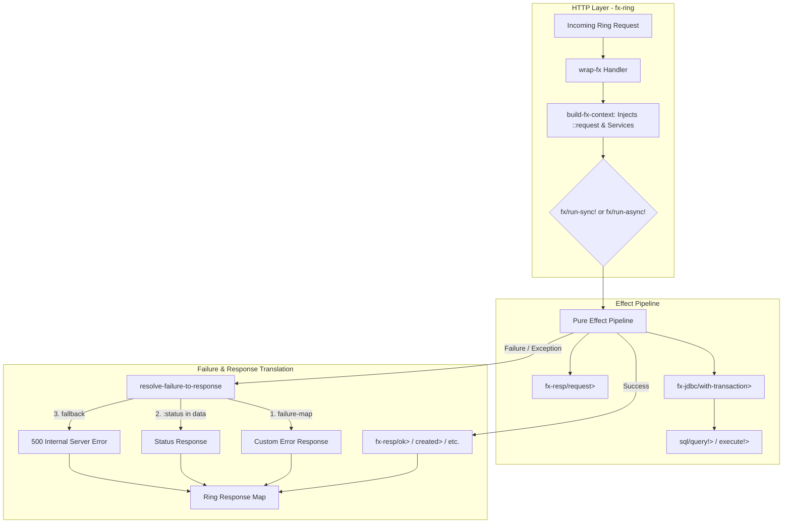

# Requirements

### Overview & Goals
The `fx` repository provides modular libraries extending the pure functional effect system: `modules/fx-jdbc` (database access via `next.jdbc`) and `modules/fx-ring` (HTTP web adapters for Ring). Currently, both modules lack dedicated module-level `README.md` files.

The goal of this task is to author clear, comprehensive, and idiomatic `README.md` documentation inside `modules/fx-jdbc/` and `modules/fx-ring/`. The documentation will provide installation instructions, core concepts, API overviews, failure handling mechanics, dependency injection workflows, and complete code examples following repository guidelines.

### Scope
- **In Scope:**
  - Create `modules/fx-jdbc/README.md` documenting `com.lambdaseq.fx.jdbc` and `com.lambdaseq.fx.jdbc.sql`.
  - Create `modules/fx-ring/README.md` documenting `com.lambdaseq.fx.ring` and `com.lambdaseq.fx.ring.response`.
  - Detail effect combinators, execution models, context resolution (`::fx-jdbc/datasource`, `::fx-ring/request`), failure structures, and error handling.
  - Provide complete, verified code examples illustrating real-world usage and integration between `fx-ring` and `fx-jdbc`.
- **Out of Scope:**
  - Changing functional code or test implementations in any module.
  - Adding non-canonical aliases or polymorphic helpers.

### User Stories
- **As a backend developer**, I want clear documentation in `modules/fx-jdbc/README.md` so that I can easily understand how to manage connection lifecycles, execute queries, run atomic transactions with automatic rollback on effect failures, and use SQL CRUD helpers.
- **As a web developer**, I want detailed documentation in `modules/fx-ring/README.md` so that I can compose HTTP endpoints as pure effect pipelines, configure hybrid failure mappings to HTTP response codes, and leverage 1-arity sync and 3-arity async Ring execution.
- **As a library user**, I want complete, working code examples illustrating how `fx-ring` and `fx-jdbc` integrate seamlessly with `fx-core` dependency injection.

### Functional Requirements
1. **`modules/fx-jdbc/README.md` Requirements:**
   - Document dependency coordinate `com.lambdaseq/fx-jdbc {:mvn/version "0.0.1-alpha"}`.
   - Document connection lifecycle combinators (`get-datasource>`, `get-connection>`, `close-connection>`, `with-connection>`).
   - Document transaction management (`with-transaction>`) with options (`:isolation`, `:read-only`, `:rollback-only`) and dual failure rollback (exceptions and `IFailure`).
   - Document statement & query execution (`execute!>`, `execute-one!>`, `plan!>`, `prepare-statement>`, `with-prepared-statement>`).
   - Document CRUD helpers in `com.lambdaseq.fx.jdbc.sql` (`insert!>`, `insert-multi!>`, `query!>`, `find-by-keys!>`, `get-by-id!>`, `update!>`, `delete!>`).
   - Document result-set builders re-exported from `next.jdbc.result-set`.
   - Document structured failure types (`:jdbc/error`, `:jdbc/missing-connectable`) and context key resolution (`::fx-jdbc/datasource`).
2. **`modules/fx-ring/README.md` Requirements:**
   - Document dependency coordinate `com.lambdaseq/fx-ring {:mvn/version "0.0.1-alpha"}`.
   - Document adapter middlewares (`wrap-fx`, `wrap-fx-failures`).
   - Document synchronous 1-arity and asynchronous 3-arity (`CompletableFuture`-driven) request evaluation.
   - Document hybrid failure resolution strategy (`:failure-map`, error data `:status` extraction, and `:default-handler` fallback).
   - Document context injection (`build-fx-context`, `:provider`, `:services`, `:context`, `::fx-ring/request`).
   - Document response constructors and modifiers in `com.lambdaseq.fx.ring.response` (`response>`, `ok>`, `created>`, `bad-request>`, `not-found>`, `internal-server-error>`, `redirect>`, `status>`, `header>`, `content-type>`).
   - Document request extraction combinator `request>`.
   - Provide an end-to-end integration example combining `fx-ring` and `fx-jdbc`.

# Technical Design

### Current Implementation
- `modules/fx-jdbc` contains:
  - `src/com/lambdaseq/fx/jdbc.clj`: Core JDBC connection, transaction, query execution, and error handling.
  - `src/com/lambdaseq/fx/jdbc/sql.clj`: Convenient SQL CRUD combinators wrapping `next.jdbc.sql`.
  - `test/com/lambdaseq/fx/jdbc_test.clj`: Unit and integration tests against H2 and SQLite.
- `modules/fx-ring` contains:
  - `src/com/lambdaseq/fx/ring.clj`: Ring HTTP middleware `wrap-fx`, `wrap-fx-failures`, context builder, and hybrid failure resolver.
  - `src/com/lambdaseq/fx/ring/response.clj`: Ring response constructors/modifiers and `request>` combinator.
  - `test/com/lambdaseq/fx/ring_test.clj`: Test suite validating sync/async execution, failure mapping, context injection, and `fx-jdbc` integration.

### Key Decisions
1. **Module-Centric Organization:**
   - *Chosen Approach:* Place standalone, detailed `README.md` files directly in `modules/fx-jdbc/` and `modules/fx-ring/`.
   - *Rationale:* Maximizes modular utility by allowing users navigating directly to each sub-project or viewing package directories to find comprehensive documentation and API references.
2. **Strict Adherence to Canonical Naming & Guidelines:**
   - *Chosen Approach:* Document only canonical names (`>` for effect constructors/combinators, `!` for runners) and deterministic argument types.
   - *Rationale:* Eliminates ambiguity, prevents code divergence, and reinforces repository guidelines.
3. **Structured API Reference Tables & End-to-End Guides:**
   - *Chosen Approach:* Combine quick-reference markdown tables with in-depth explanations and runnable workflow examples.
   - *Rationale:* Provides immediate lookup value for seasoned developers while guiding newcomers through end-to-end effect composition.

### Architecture & Data Flow

### Documentation Structure

#### `modules/fx-jdbc/README.md`
1. **Header & Overview**: Purpose, key capabilities, and Maven coordinates.
2. **Philosophy & Mental Model**: Pure descriptions over execution, automated resource lifecycle, transaction boundary safety.
3. **API Overview**:
   - Connection & Datasource Management (`get-datasource>`, `get-connection>`, `close-connection>`, `with-connection>`).
   - Transactions (`with-transaction>`, savepoints, isolation levels, rollback triggers).
   - Statement & Query Execution (`execute!>`, `execute-one!>`, `plan!>`, `prepare-statement>`, `with-prepared-statement>`).
   - SQL CRUD Operations (`insert!>`, `insert-multi!>`, `query!>`, `find-by-keys!>`, `get-by-id!>`, `update!>`, `delete!>`).
   - Result Set Builders (`as-maps`, `as-unqualified-maps`, `as-kebab-maps`, etc.).
   - Failure Model (`:jdbc/error`, `:jdbc/missing-connectable`).
4. **Context Injection & Dependency Management**: Binding `::fx-jdbc/datasource` in effect context.
5. **Usage Examples**: CRUD workflow, connection pooling, transactional pipeline.

#### `modules/fx-ring/README.md`
1. **Header & Overview**: Purpose, key capabilities, and Maven coordinates.
2. **Philosophy & Mental Model**: Pure effect handlers at web boundaries, decoupling business logic from HTTP transport.
3. **API Overview**:
   - Handler Wrappers (`wrap-fx`, `wrap-fx-failures`).
   - Response Constructors (`response>`, `ok>`, `created>`, `bad-request>`, `not-found>`, `internal-server-error>`, `redirect>`).
   - Response Modifiers (`status>`, `header>`, `content-type>`).
   - Request Combinators (`request>`).
4. **Failure Translation**: Hybrid resolution order (`:failure-map` -> `:status` extraction -> `:default-handler`).
5. **Context & Dependency Injection**: `:provider`, `:services`, `:context`, `::fx-ring/request`.
6. **Sync & Async Execution**: 1-arity vs 3-arity Ring handlers with `CompletableFuture`.
7. **Complete Example**: Full CRUD API backed by `fx-jdbc`.

### File Structure
- `modules/fx-jdbc/README.md` (new file)
- `modules/fx-ring/README.md` (new file)

# Testing

### Validation Approach
Verify that all documented APIs, functions, options, failure keys, context keys, and code snippets match the implemented codebase and pass static review.

### Key Scenarios to Verify
1. **API Signature Accuracy**:
   - Ensure all function signatures, arities, and parameter names in `modules/fx-jdbc/README.md` match `com.lambdaseq.fx.jdbc` and `com.lambdaseq.fx.jdbc.sql`.
   - Ensure all function signatures in `modules/fx-ring/README.md` match `com.lambdaseq.fx.ring` and `com.lambdaseq.fx.ring.response`.
2. **Context Key Precision**:
   - Verify that `::fx-jdbc/datasource` (`:com.lambdaseq.fx.jdbc/datasource`) is accurately documented for JDBC context resolution.
   - Verify that `::fx-ring/request` (`:com.lambdaseq.fx.ring/request`) is accurately documented for Ring request context resolution.
3. **Failure Mapping Semantics**:
   - Verify the hybrid resolution order in `fx-ring` documentation matches `resolve-failure-to-response` logic.
4. **Code Example Verifiability**:
   - Validate that all Clojure code snippets in both README files represent valid, executable `fx` pipelines without syntax errors or invalid arities.

# Delivery Steps

### ✓ Step 1: Create documentation README for modules/fx-jdbc
A comprehensive README.md is created for `modules/fx-jdbc` covering all public namespaces, combinators, and lifecycle patterns.

- Create `modules/fx-jdbc/README.md` with module overview, installation instructions (`{:deps {com.lambdaseq/fx-jdbc {:mvn/version "0.0.1-alpha"}}}`), and architectural philosophy.
- Document `com.lambdaseq.fx.jdbc` core lifecycle and execution functions: `get-datasource>`, `get-connection>`, `close-connection>`, `with-connection>`, and `with-transaction>` (including `:isolation`, `:read-only`, and `:rollback-only` options).
- Document query and statement execution: `execute!>`, `execute-one!>`, `plan!>`, `prepare-statement>`, `with-prepared-statement>`, and result-set builders (`as-maps`, `as-unqualified-maps`, `as-kebab-maps`, `as-unqualified-kebab-maps`, `as-lower-maps`, `as-unqualified-lower-maps`, `as-modified-maps`).
- Document high-level SQL CRUD combinators in `com.lambdaseq.fx.jdbc.sql`: `insert!>`, `insert-multi!>`, `query!>`, `find-by-keys!>`, `get-by-id!>`, `update!>`, and `delete!>`.
- Document failure models (`:jdbc/error`, `:jdbc/missing-connectable`) and context dependency injection with `::fx-jdbc/datasource` (`:com.lambdaseq.fx.jdbc/datasource`).
- Include complete, copy-pasteable Clojure code examples demonstrating connection scoping, transactional rollback on `IFailure`, and queries.

### ✓ Step 2: Create documentation README for modules/fx-ring
A comprehensive README.md is created for `modules/fx-ring` covering Ring HTTP handler adaptation, response combinators, failure mappings, and context injection.

- Create `modules/fx-ring/README.md` with module overview, installation instructions (`{:deps {com.lambdaseq/fx-ring {:mvn/version "0.0.1-alpha"}}}`), and design philosophy.
- Document HTTP middleware and runner mechanics in `com.lambdaseq.fx.ring`: `wrap-fx`, `wrap-fx-failures`, `build-fx-context`, and `resolve-failure-to-response`.
- Detail 1-arity synchronous `(fn [req])` execution via `fx/run-sync!` and 3-arity asynchronous `(fn [req respond raise])` execution via `fx/run-async!`.
- Document hybrid failure handling: `:failure-map` tag matching, automatic HTTP status code extraction from `error-data`, and `:default-handler` fallback.
- Document context and service injection options (`:provider`, `:services`, `:context`) supporting static maps and dynamic `(fn [req] ...)` functions, along with `::fx-ring/request`.
- Document response constructors and modifiers in `com.lambdaseq.fx.ring.response`: `response>`, `ok>`, `created>`, `bad-request>`, `not-found>`, `internal-server-error>`, `redirect>`, `status>`, `header>`, `content-type>`, and request extractor `request>`.
- Include end-to-end examples demonstrating async REST endpoints, error translation, and integration with `fx-jdbc` connection pools.

### ✓ Step 3: Validate documentation accuracy and code examples
All code snippets, namespace references, and API signatures across both README files are validated against the codebase.

- Verify that all code examples in `modules/fx-jdbc/README.md` adhere to canonical naming conventions (`>` for effects, `!` for runners) and deterministic parameter types.
- Verify that all code examples in `modules/fx-ring/README.md` match the implementation signatures in `com.lambdaseq.fx.ring` and `com.lambdaseq.fx.ring.response`.
- Verify consistent Markdown formatting, table layouts, and cross-module links.