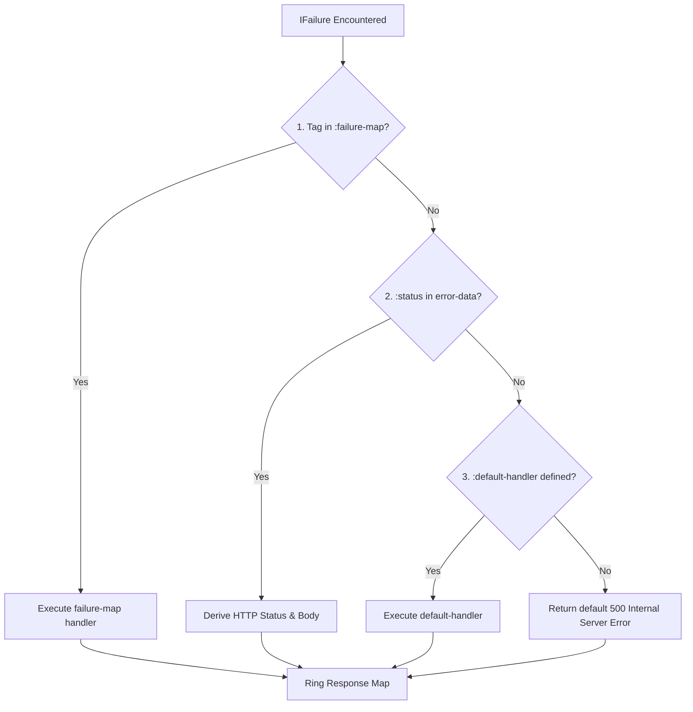

# fx/ring

Ring HTTP middleware and response combinators for the `fx` effect system.

`fx-ring` seamlessly bridges pure functional `fx` effect pipelines to Ring-compliant web servers. It allows you to write endpoints as declarative effect workflows with deterministic dependency injection, hybrid failure translation to HTTP response codes, and support for both 1-arity synchronous and 3-arity asynchronous Ring specifications.

## Installation

Add the dependency to your `deps.edn`:

```clojure
{:deps {io.github.conjurernix/fx.ring {:mvn/version "0.2.0"}}}
;; or local module coordinate
{:deps {fx/ring {:mvn/version "0.2.0"}}}
```

Requires `fx/core` (`io.github.conjurernix/fx.core`).

## Philosophy & Mental Model

- **Handlers as Pure Effect Descriptions**: Endpoints are modeled as immutable effect pipelines that declare their input dependencies and failure conditions without performing direct I/O during pipeline definition.
- **Unified Boundary Evaluation**: Middleware (`wrap-fx`) executes the effect pipeline at the edge using `fx/run-sync!` for 1-arity synchronous calls or `fx/run-async!` (backed by `CompletableFuture`) for 3-arity asynchronous calls.
- **Deterministic Context Injection**: The incoming Ring request is automatically bound to `::fx-ring/request` (`:fx.ring/request`) alongside optional static or per-request services.
- **Hybrid Failure Resolution**: Failures flow through the typed `IFailure` channel and are automatically translated to HTTP response maps using tag matching, status code reflection, or custom default fallbacks.

---

## Quickstart

```clojure
(ns example.web
  (:require [fx.core :as fx]
            [fx.ring :as fx-ring]
            [fx.ring.response :as fx-resp]))

;; Define endpoint effect pipeline
(def greet-endpoint
  (-> (fx-resp/request> :params)
      (fx/map> (fn [params] (get params :name "World")))
      (fx/mapcat> (fn [name]
                    (if (= name "forbidden")
                      (fx/fail> :auth/forbidden {:status 403 :message "Access denied"})
                      (fx-resp/ok> (str "Hello, " name "!")))))))

;; Wrap into a standard Ring handler
(def app
  (fx-ring/wrap-fx greet-endpoint))

;; 1-Arity Synchronous Execution
(app {:request-method :get :uri "/greet" :params {:name "Alice"}})
;; => {:status 200, :headers {}, :body "Hello, Alice!"}

(app {:request-method :get :uri "/greet" :params {:name "forbidden"}})
;; => {:status 403, :headers {}, :body {:message "Access denied"}}
```

---

## API Reference

### Ring Adapter & Middleware (`fx.ring`)

| Function | Signature | Description |
|---|---|---|
| `wrap-fx` | `([effect] [effect opts])` | Adapts an `IEffect` pipeline into a Ring handler supporting 1-arity sync `(fn [req])` and 3-arity async `(fn [req respond raise])`. |
| `wrap-fx-failures` | `([handler] [handler opts])` | Middleware for standard Ring handlers that catches returned `IFailure` instances and transforms them into HTTP responses. |
| `build-fx-context` | `[req opts]` | Merges `{::fx-ring/request req}` with resolved `:provider`, `:services`, or `:context` into an effect context map. |
| `resolve-failure-to-response` | `([failure req] [failure req opts])` | Translates an `IFailure` into a Ring response map using the hybrid resolution strategy. |

#### `wrap-fx` Options Map

- `:provider` - A static service map or a dynamic function `(fn [req] ...)` returning service bindings merged into context.
- `:services` / `:context` - Aliases for `:provider`.
- `:failure-map` - Map of failure tags (`keyword`) to handler functions `(fn [error-data req])`, `(fn [error-data])`, or direct response maps.
- `:default-handler` - Fallback handler function `(fn [failure req])` invoked when no tag matches in `:failure-map`.

---

### Request Combinators (`fx.ring.response`)

| Function | Signature | Description |
|---|---|---|
| `request>` | `([] [key] [key default-val])` | Creates an effect reading the active Ring request map or a specific key from context key `::fx-ring/request`. |

```clojure
;; Read entire request map
(fx-resp/request>)

;; Read specific field
(fx-resp/request> :uri)

;; Read with fallback
(fx-resp/request> :remote-addr "127.0.0.1")
```

---

### Response Constructors & Modifiers (`fx.ring.response`)

Constructors and modifiers integrate with standard threading (`->`):

| Function | Signature | Description |
|---|---|---|
| `response>` | `([body] [eff body])` | Creates an effect yielding a `200 OK` response with `body`. |
| `ok>` | `([] [body] [eff body])` | Creates an effect yielding a `200 OK` response with optional `body`. |
| `created>` | `([url] [url body] [eff url body])` | Creates an effect yielding a `201 Created` response with `Location` header `url`. |
| `bad-request>` | `([] [body] [eff body])` | Creates an effect yielding a `400 Bad Request` response with optional `body`. |
| `not-found>` | `([] [body] [eff body])` | Creates an effect yielding a `404 Not Found` response with optional `body`. |
| `internal-server-error>` | `([] [body] [eff body])` | Creates an effect yielding a `500 Internal Server Error` response with optional `body`. |
| `redirect>` | `([url] [url status] [eff url status])` | Creates an effect yielding a `302 Found` (or custom status) redirect response. |
| `status>` | `([status-code] [eff status-code])` | Sets the HTTP status code on the upstream response map. |
| `header>` | `([header-name header-val] [eff header-name header-val])` | Sets an HTTP header on the upstream response map. |
| `content-type>` | `([content-type-str] [eff content-type-str])` | Sets the `Content-Type` header on the upstream response map. |

---

## Failure Translation Architecture

When an effect pipeline evaluates to an `IFailure`, `wrap-fx` converts it into an HTTP response using a **3-tier hybrid resolution strategy**:



### 1. Explicit Tag Matching (`:failure-map`)

Define custom translation functions per failure tag:

```clojure
(def app
  (fx-ring/wrap-fx
    endpoint
    {:failure-map
     {:user/not-found
      (fn [data req]
        {:status 404
         :headers {"Content-Type" "application/json"}
         :body {:error "User not found" :id (:user-id data) :path (:uri req)}})

      :auth/token-expired
      (fn [_data _req]
        {:status 401
         :headers {"WWW-Authenticate" "Bearer error=\"token_expired\""}
         :body {:error "Token expired"}})}}))
```

### 2. Status Reflection (`error-data` contains `:status`)

If `error-data` is a map containing an integer `:status`, `fx-ring` extracts the status code and headers automatically:

```clojure
;; Emitting this failure inside an effect:
(fx/fail> :validation/invalid-input
          {:status 422
           :headers {"X-Validation-Error" "true"}
           :fields {:email "Invalid format"}})

;; Produces HTTP response:
;; {:status 422
;;  :headers {"X-Validation-Error" "true"}
;;  :body {:fields {:email "Invalid format"}}}
```

### 3. Fallback (`:default-handler` or 500)

Unmatched failures default to `:default-handler` or a generic `500 Internal Server Error`:

```clojure
(def app
  (fx-ring/wrap-fx
    endpoint
    {:default-handler
     (fn [failure req]
       {:status 500
        :headers {"Content-Type" "application/json"}
        :body {:tag (fx/tag failure)
               :path (:uri req)
               :message "An unexpected error occurred"}})}))
```

---

## Context & Dependency Injection

`wrap-fx` automatically populates the effect context for every request.

### Static Service Maps

```clojure
(def app
  (fx-ring/wrap-fx
    endpoint
    {:provider {:app-config {:env "production" :version "1.0.0"}
                :audit-log  audit-service}}))
```

### Dynamic Request-Aware Providers

Provide dynamic per-request context (e.g., authentication tokens or request IDs):

```clojure
(def app
  (fx-ring/wrap-fx
    endpoint
    {:provider (fn [req]
                 {:correlation-id (get-in req [:headers "x-correlation-id"] (str (java.util.UUID/randomUUID)))
                  :session-user   (get-in req [:session :user])})}))
```

Inside your effect pipeline, access these services with `fx/service>`:

```clojure
(def endpoint
  (-> (fx/service> :correlation-id)
      (fx/mapcat> (fn [cid]
                    (-> (fx-resp/ok> {:status "healthy"})
                        (fx-resp/header> "X-Correlation-ID" cid))))))
```

---

## Sync & Async Ring Execution

`wrap-fx` produces a dual-mode Ring handler supporting synchronous and asynchronous web adapters (such as Jetty or Ring-Undertow):

### 1-Arity Synchronous Mode

```clojure
;; Ring evaluates synchronously
(let [response (app request)]
  (process-response response))
```

### 3-Arity Asynchronous Mode

```clojure
;; Non-blocking asynchronous evaluation driven by CompletableFuture
(app request
     (fn [response] (send-http-response response))
     (fn [throwable] (handle-fatal-error throwable)))
```

---

## End-to-End Integration with `fx-jdbc`

Here is a complete, real-world example demonstrating `fx-ring` integrated with `fx-jdbc` for database-backed REST endpoints:

```clojure
(ns example.api
  (:require [fx.core :as fx]
            [fx.jdbc :as fx-jdbc]
            [fx.jdbc.sql :as sql]
            [fx.ring :as fx-ring]
            [fx.ring.response :as fx-resp]))

;; 1. Define Business / Query Effect Pipeline
(defn get-user-by-id-endpoint []
  (-> (fx-resp/request> :params)
      (fx/map> (fn [params] (Integer/parseInt (get params :id "0"))))
      (fx/mapcat> (fn [user-id]
                    ;; Resolve datasource injected by wrap-fx provider
                    (-> (fx/service> ::fx-jdbc/datasource)
                        (fx/mapcat> (fn [ds]
                                      (fx-jdbc/with-connection> ds
                                        (fn [_conn]
                                          (-> (sql/get-by-id!> :users user-id {:builder-fn fx-jdbc/as-unqualified-kebab-maps})
                                              (fx/mapcat> (fn [user]
                                                            (if user
                                                              (-> (fx-resp/ok> user)
                                                                  (fx-resp/content-type> "application/json"))
                                                              (fx/fail> :user/not-found
                                                                        {:status 404
                                                                         :message (str "User " user-id " not found")}))))))))))))))

;; 2. Set Up Datasource & Ring App
(def db-spec {:dbtype "h2:mem" :dbname "api_db;DB_CLOSE_DELAY=-1"})

(defn create-app []
  (let [ds (fx/run-sync! (fx-jdbc/get-datasource> db-spec))]
    ;; Initialize schema
    (fx/run-sync!
      (fx-jdbc/with-connection> ds
        (fn [_]
          (-> (fx-jdbc/execute!> ["CREATE TABLE users (id INT PRIMARY KEY, name VARCHAR(255), email VARCHAR(255))"])
              (fx/mapcat> (fn [_] (sql/insert!> :users {:id 1 :name "Alice" :email "alice@example.com"})))))))

    ;; Wrap handler with datasource injected into context
    (fx-ring/wrap-fx
      (get-user-by-id-endpoint)
      {:provider {::fx-jdbc/datasource ds}
       :failure-map
       {:user/not-found
        (fn [err _req]
          {:status 404
           :headers {"Content-Type" "application/json"}
           :body {:error (:message err)}})}})))

;; 3. Execute Endpoint
(def app (create-app))

;; Success Query:
(app {:request-method :get :uri "/users" :params {:id "1"}})
;; => {:status 200, :headers {"Content-Type" "application/json"}, :body {:id 1, :name "Alice", :email "alice@example.com"}}

;; Not Found Failure:
(app {:request-method :get :uri "/users" :params {:id "999"}})
;; => {:status 404, :headers {"Content-Type" "application/json"}, :body {:error "User 999 not found"}}
```
